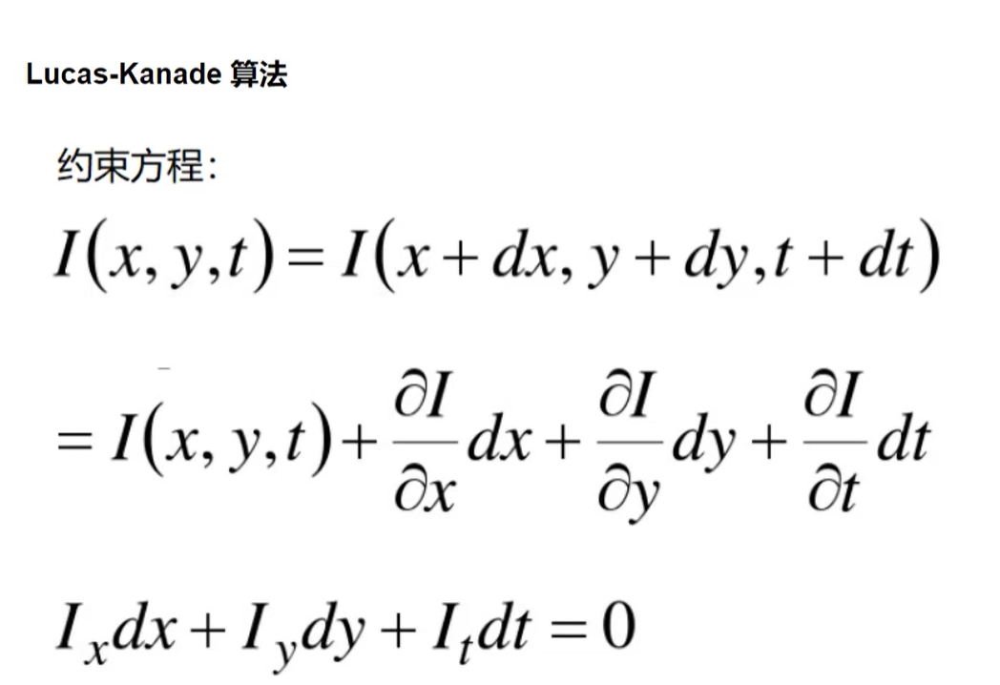
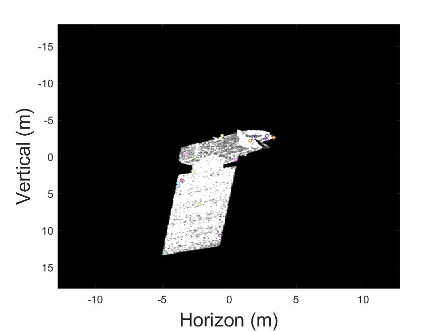
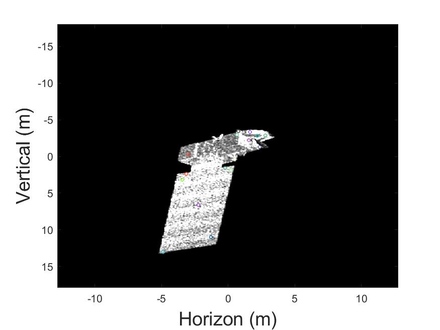
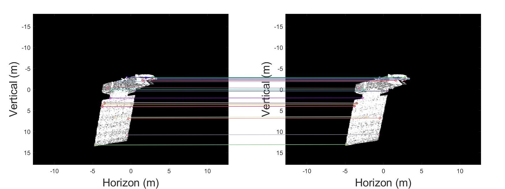

# 周报10.16
---

#### 本周任务：了解光流特征追踪算法，并在上周实验基础上进行实验

#### 算法原理：
##### 光流估计：
光流是空间运动物体在观测成像平面上的像素运动的“瞬时速度”，根据各个像素点的速度矢量特征，可以对图像进行动态分析，例如目标跟踪。
**亮度恒定**: 同一点随着时间的变化，其亮度不会发生改变；
**小运动**:随着时间的变化不会引起位置的剧烈变化，只有小运动情况下才能用前后帧之间单位位置变化引起的灰度变化去近似灰度对位置的偏导数；
**空间一致**:一个场景上邻近的点投影到图像上也是邻近点，且邻近点速度一致，因为光流法基本方程约束只有一个，而要求x，方向的速度，有两个未知变量。所以需要连立n多个方程求解。

#### 实验步骤：
1. [对相邻帧进行SIFT特征点提取+匹配](https://blog.csdn.net/DeerDolphin/article/details/104727258?ops_request_misc=%257B%2522request%255Fid%2522%253A%2522169746797016800225513813%2522%252C%2522scm%2522%253A%252220140713.130102334..%2522%257D&request_id=169746797016800225513813&biz_id=0&utm_medium=distribute.pc_search_result.none-task-blog-2~all~top_positive~default-1-104727258-null-null.142^v96^pc_search_result_base6&utm_term=sift%E7%89%B9%E5%BE%81%E5%8C%B9%E9%85%8D&spm=1018.2226.3001.4187)
2. RANSAC去除误匹配点
3. 对剩余的特征点进行光流特征追踪算法，留下最终筛选出来的特征点

#### 实验结果：

|图1特征点|图2特征点|
|---|---|
|||

两帧图像匹配的特征点

#### 结论：
经过光流估计算法筛选出来的特征点，具有其对应的图像灰度值恒定，小运动以及邻近点速度一致的性质，使得相邻帧的特征点更具有相关性。但是经过多次筛选特征点，剩余的特征点越来越少，意味着丢失了图像中的很多细节和信息，可能导致匹配或检测的准确性降低

