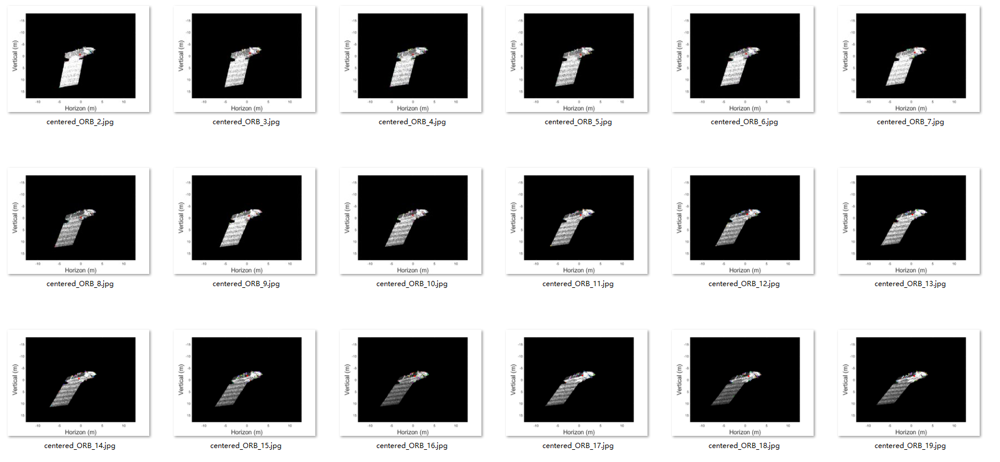
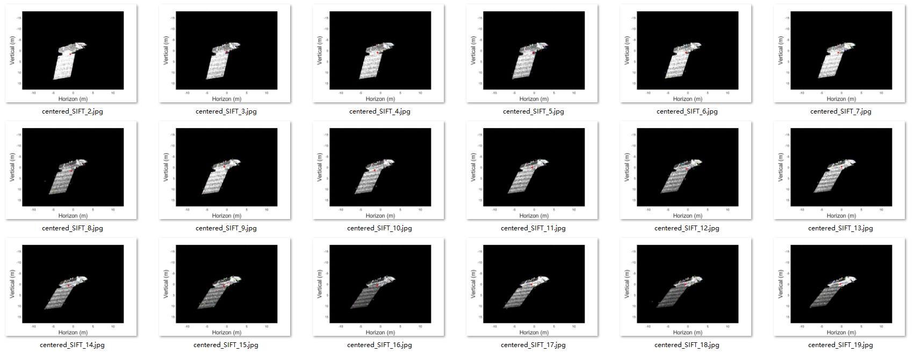

# 周报10.23
---

#### 本周任务：改换利用ORB特征点提取并与上周实验进行对比

#### 实验步骤：
1. **提取特征点：**
使用ORB和SIFT算法分别对图像进行特征点提取
2. **特征点匹配**：
3. **使用RANSAC估计基础矩阵**
4. **光流估计**：
初始化光流估计器，用于计算特征点的运动。
计算特征点的运动向量，将光流估计成功的特征点筛选出来。
1. **计算质心点：**
计算每张图像中特征点的质心坐标。
在原图像上标出质心点的位置，并保存带有质心点的图像。
1. **计算特征点位置方差：**
计算每张图像中质心点周围特征点的位置方差
1. **输出结果：**
将每张图像的质心坐标、特征点匹配结果、特征点位置方差写入图像文件和文本文件。

#### 实验结果：

**ORB特征点**每帧中质心点的位置方差

|第i帧到第i+1帧|1|2|3|4|5|6|7|8|9|10|11|12|13|14|15|16|17|18|19|
|---|---|---|---|---|---|---|---|---|---|---|---|---|---|---|---|---|---|---|---|
|第i帧到第i+1帧的方差|36.46970574888728|68.32166892445133|20.326484129875066|95.39859140098211|76.22124701096949|64.05015405389383|84.3380253104305|48.875935868758475|88.72276257589431|38.24460678378773|73.85891208181822|95.3080181524636|23.141658827660155|74.82266289719722|97.13710086024686|112.37980297735045|111.38678121130658|43.06912680747852|46.788768997577975|

**SIFT特征点**每帧中质心点的位置方差

|第i帧到第i+1帧|1|2|3|4|5|6|7|8|9|10|11|12|13|14|15|16|17|18|19|
|---|---|---|---|---|---|---|---|---|---|---|---|---|---|---|---|---|---|---|---|
|第i帧到第i+1帧的方差|201.12485965326013|221.84289318680757|173.3380885663695|223.1065030933694|69.75425571364364|160.81000412979523|84.36691043261109|71.87766413895314|65.01726764833553|49.35230711370612|99.90885405889772|37.97465454441096|36.9360922876199|44.92517380300224|43.470067127738275|20.249756087540284|34.00784372828721|27.877278899943438|32.31239490584463|

#### 结论：
由ORB特征点计算出的质心与相邻的特征点之间的距离方差要小于SIFT特征点计算出的质心与相邻的特征点之间的距离方差。也就是说较低的方差通常表示质心点比较稳定，而较高的方差可能表示质心点周围的特征点分布比较散乱。

