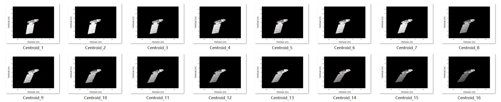

# 周报10.8
---

## 工作目标：改进个别特征点明显存在匹配错误的问题

## 关键思路：采用RANSAC（Random Sample Consensus）算法排除异常特征点对

RANSAC可以用于检测异常值或离群点。异常值是与估计的模型不一致的数据点。通过拟合模型并将数据点分类为内点（与模型一致）和外点（与模型不一致），RANSAC可以检测并排除异常值，减少拟合的误差，使模型估计更稳健。

## 实验结果：

排除了大部分匹配错误的特征点对，可能有助于提高质心配准的准确性。

