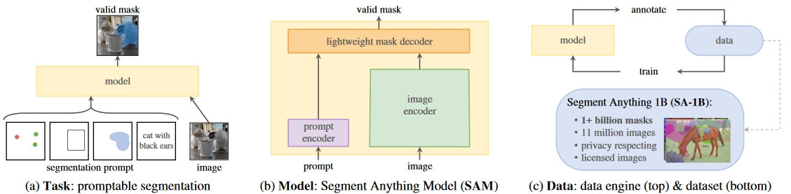
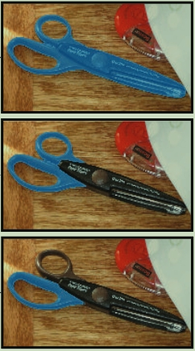

# 周报11.14
# SAM大模型

## Introduction

-  NLP 中引入具有强零样本和少样本泛化能力的大型语言模型。
- 受此启发，在计算机视觉中使用基础模型和“提示”工程来实现零样本泛化。
## 研究内容

### Task

- 引入可提示的分割任务，实现零样本泛化。
- 要求模型在给定任何分段提示（点，框，文本）时返回有效的分段掩码。
- 可处理模糊提示，如下图一个点prompt会生成3张masks

### Model
- 引入带有图像编码器、提示编码器和轻量级掩模解码器的分段任意模型 (SAM)。
- **Image encoder**：经典的Vit模型是用来处理低分辨率的输入图像，调整MAE（预训练过的Vit模型）来处理高分辨率的输入图像

- **Prompt encoder**：
    1. 稀疏提示：点、方框、文本，前二者用位置编码来表示，文本用CLIP模型文本编码器来表示
    2. 稠密提示：masks，使用卷积嵌入，并与图像嵌入按元素求和

- **Lightweight mask decoder**：
掩码解码器有效地将图像嵌入、提示嵌入和输出token映射到mask。
- **模糊处理**：对于不明确的prompt，模型会给出3个有效的masks（整体、部分、子部分）

### Data Engine

由于互联网上的分割掩码并不丰富，作者提出了以下方案，同时提高了模型和数据集的质量。

数据引擎分为以下3个阶段：
**1. Assisted-manual stage**：
一组专业标注员使用由SAM支持的基于浏览器的交互式分割工具，通过点击前景/背景对象点来标记掩码。在此阶段开始时，使用常见的公共分割数据集对SAM进行了训练。在进行足够的数据标注后，SAM使用仅包括新标注的掩码进行了重新训练。
**2. Semi-automatic stage**：
目标是增加掩码的多样性，以提高我们模型分割任何物体的能力。为了让标注员专注于不太突出的对象，我们首先自动检测到有信心的掩码。然后，我们向标注员展示了用这些掩码预填充的图像，并要求他们注释任何其他未标记的对象。
**3. Fully automatic stage**：
在最后一个阶段，注释完全自动化进行。这得益于我们模型的两个重大改进。首先，在这个阶段开始时，我们已经收集了足够多的掩码，极大地改善了模型，包括来自前一阶段的多样性掩码。其次，到了这个阶段，我们已经开发了具有模糊感知能力的模型，这使我们能够在模糊情况下预测有效的掩码。

## 研究成果
### 数据集

- 创建 SA 1B 数据集，其中包含来自 1100 万张许可和隐私保护图像的超过 10 亿个掩模，其中99.1%是由模型全自动生产的。
- 验证 SA 1B 数据集的高质量和多样性。

### 零样本迁移和相关任务

- 预训练任务使模型能够通过设计适当的提示来解决下游任务，使其成为各种分割任务的广泛能力模型。
- 提示和组合使单个模型能够以可扩展的方式使用，类似于其他基础模型的使用方式，从而允许更广泛的应用程序。
- 这种方法允许将经过训练的快速分割模型组合成更大的算法系统，展示其广泛的实用性。

