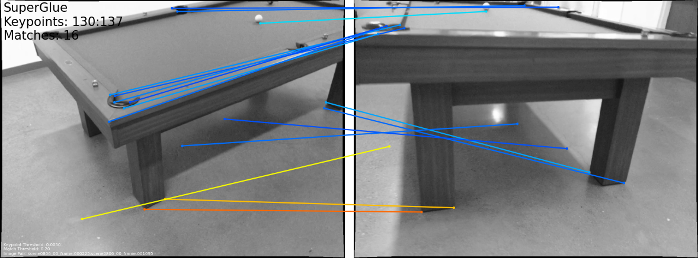
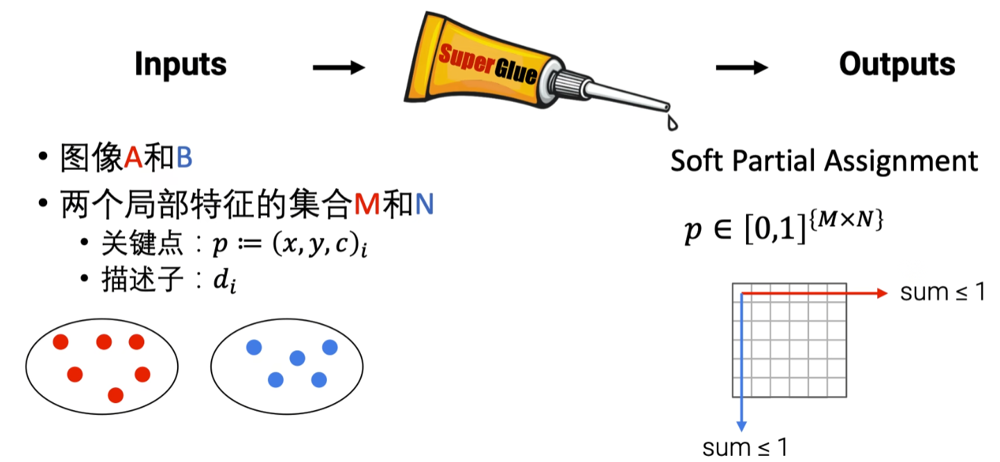
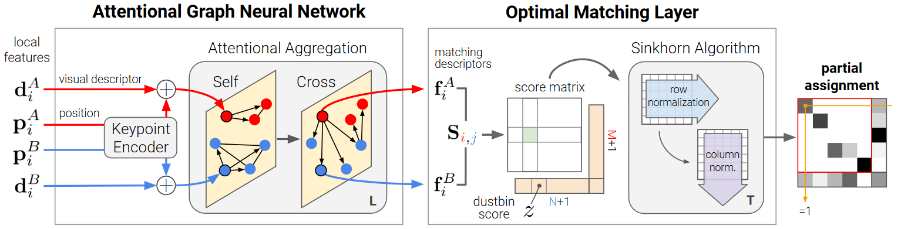
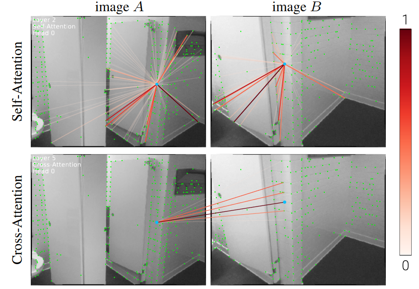
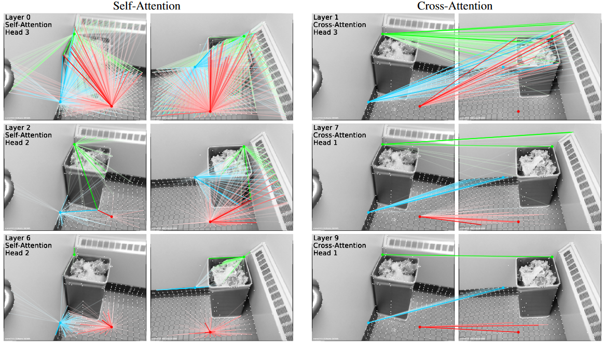
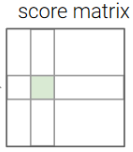
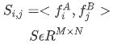
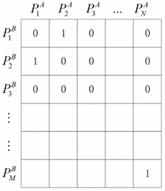
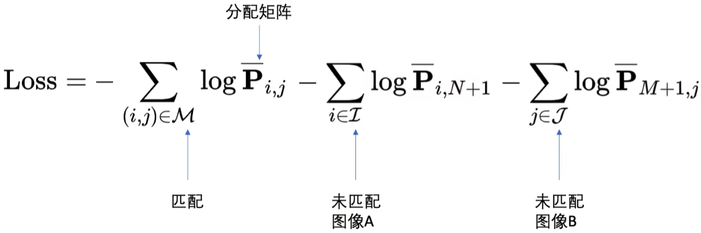

# 精读SuperGlue

## 任务

**匹配图像对中的特征点**

## 总体框架

## SuperGlue网络模型

### 注意力机制图神经网络

初始化

- 为每一个特征点做初始化，得到XiA​  i=1,2,...,M​
- XiA=diA+MLP(piA)​   
- 对图像**B**也做同样的操作

图网络

- 以上特征向量作为基于自注意力和交叉注意力机制的图网络的节点

 

### 最优匹配层

求解线性最优化问题

**得分矩阵$S$**

**分配矩阵$P$**

$p_{ij}$表示$P_i^A$和$P_j^B$是否匹配。1表示匹配，0表示不匹配

如果$P_i^A$和$P_j^B$匹配，则两者对应得分矩阵的$S_{i,j}$是在彼此所在行所在列中应该是最大的

最终求解的目标

### 损失函数

[论文地址](https://arxiv.org/abs/1911.11763)
[项目地址](http://github.com/magicleap/SuperGluePretrainedNetwork)

参考\[[1](https://www.bilibili.com/video/BV1C34y1S7ik/?spm_id_from=333.1007.top_right_bar_window_custom_collection.content.click&vd_source=a89b12627ca04acecf43505f7b98fe0a)]\[[2](https://www.bilibili.com/video/BV1pN4y187jv/?spm_id_from=333.1007.top_right_bar_window_custom_collection.content.click&vd_source=a89b12627ca04acecf43505f7b98fe0a)]\[[3](https://blog.csdn.net/weixin_44580210/article/details/122284145)]\[[4](https://blog.csdn.net/a486259/article/details/131137959)]\[[5](https://zhuanlan.zhihu.com/p/342105673)]

