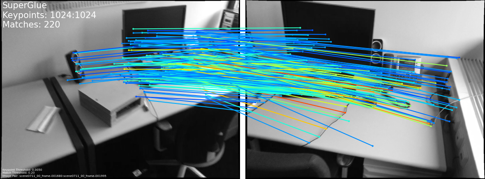
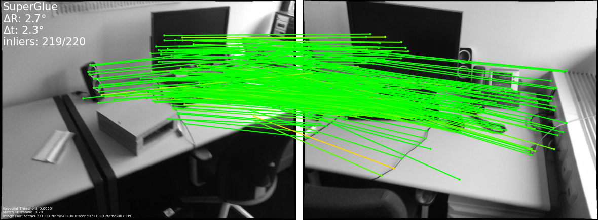

# 3.28周报

#### SuperGlue项目代码复现

项目可选**匹配**和**评估**模式进行

### 匹配

先对两张图像进行特征点**匹配**



可视化结果：两张图像各提取了1024个特征点，共有220对点匹配成功

### 评估

需要提供真实相对位姿和相机内参，才可对其进行评估。`.txt`文件包含三个矩阵： image0: 的 3x3 内在矩阵`K0`、 image1: 的 3x3 内参矩阵`K1`和相对姿态外在矩阵 4x4 `T_0to1`



程序估计出两个图像之间的相对位姿，包含估计的旋转矩阵**R**、平移向量**t**和内点**inliers**，并与真实相对位姿`T_0to1`计算角度误差


在终端执行

```shell
python ./match_pairs.py --input_pairs assets/scannet_sample_pairs_with_gt.txt --input_dir assets/scannet_sample_images --output_dir dump_scannet_test_results --eval --resize -1 --viz
```

