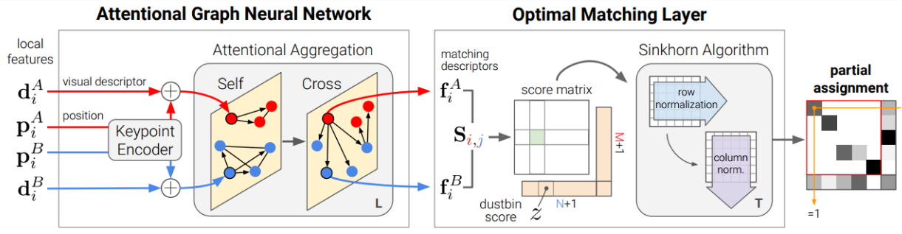

## 4.3 周报

### SuperGlue局部特征匹配

SuperGlue是一种特征匹配网络，它的输入是2张图像中**特征点**以及**描述子**（手工特征或者深度学习特征均可），输出是图像特征之间的**匹配关系**。作者受到了Transformer的启发，同时将self-和cross-attention利用特征点位置以及其视觉外观进行匹配

### 框架以及原理

特征匹配必须满足的要求是：

> i)至多有1个匹配点；ii)有些点由于遮挡等原因并没有匹配点。

整个框架由两个主要模块组成：**注意力GNN**以及**最优匹配层**。其中注意力GNN将特征点以及描述子编码成为一个向量（该向量可以理解为特征匹配向量），随后利用自我注意力以及交叉注意力来回增强（重复**L**次）这个向量的特征匹配性能；随后进入最优匹配层，通过计算特征匹配向量的内积得到匹配度得分矩阵，然后通过Sinkhorn算法（迭代**T**次）解算出最优特征分配矩阵

#### KeypointEncode

特征点位置+描述会获得更强的特征匹配特异性，所以这里将特征点的位置以及描述子合并成每个特征点的初始表示:

其中MLP表示多层感知机（Multilayer Perceptron ，MLP）此处用于对低维特征升维

#### Attentional Aggregation

考虑一个单一的完全图，它的节点是图像中每个特征点，这个图包括两种不同的无向边：一种是“Intra-image edges”（self edge） ，它连接了来自图像内部特征点；另外一种是“Inter-image edges”（cross edge） ，它连接本图特征点**i**与另外一张图所有特征点

信息（message）m是聚合了所有特征点之后点结果

经过了L次self/cross-attention后就可以得到注意力GNN的输出其中[⋅|⋅]表示合并操作。同样的，图像B上所有特征有类似的更新形式。

#### Optimal matching layer

接下来的任务就是去构建软分配矩阵**P**。对于一般的图匹配流程，这个分配矩阵可以通过计算一个得分矩阵**S**（用来表示一些潜在的匹配）来实现，其中

f为注意力GNN网络的匹配描述子（matching descriptor）

最终，问题被简化为了一个最优化传输问题

其中

### Loss

GNN网络以及最优匹配层都是可微的，这使得反向传播训练成为可能。网络训练使用了一种监督学习的方式，即有了匹配的真值（如，由真值相对位姿变换得到的匹配关系）。当给定真值标签，就可以去最小化分配矩阵P负对数似然函数

这个监督学习的目标是同时最大化精度以及匹配的召回率，不过训练过程作者没有给出

