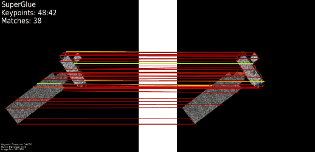
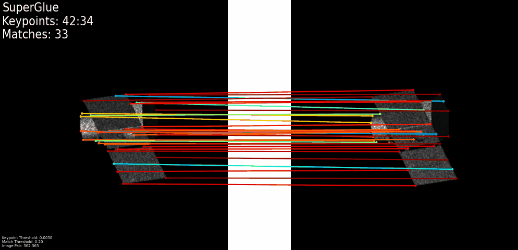
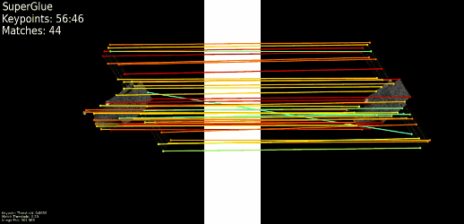
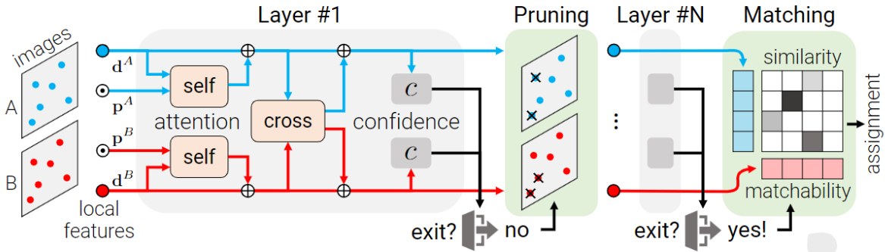

## 4.11周报

### 用SuperGlue测试三组目标数据

修改代码，对统一目标运动序列连续匹配的特征点个数进行观测

### LightGlue论文阅读

LightGlue网络框架

SuperGlue网络框架

**对比：**

Superglue通过使用Sinkhorn算法解决可微的最优运输问题来预测分配，由于Sinkhorn非常昂贵，Superglue不能在每一层之后进行预测，只在最后一层进行监督。而LightGlue对每一层的任务并进行监督，加快了收敛速度，并允许在任何层之后退出推理，这是LightGlue效率提高的关键

