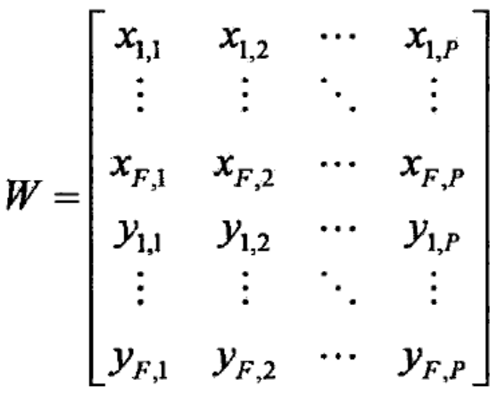
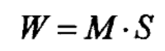
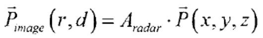
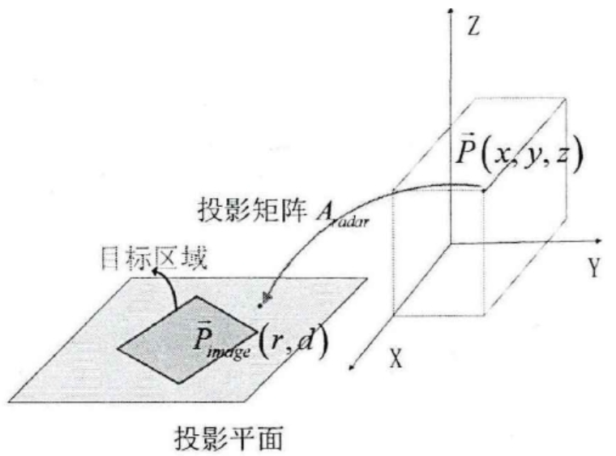
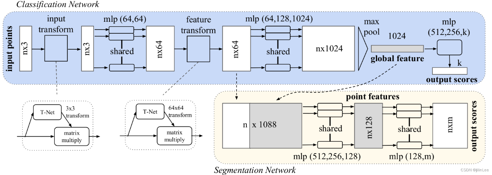

# 4.25

**阅读刘营师兄毕业论文**

了解**因式分解**跟**投票投影法**间的区别

共同点：二者都是基于图像序列的三维重构方法

#### 因式分解

在 **F 帧图像**中需要追踪 **P 个特征点**，将各个散射点在每一帧图像中的横纵坐标放入一个**观测矩阵W（2FxP）**中

**因式分解**就是将**观测矩阵W**表示为**运动矩阵Ｍ**和**形状矩阵S**的乘积，即

**Ｍ**表示雷达相对于目标的运动矩阵，**Ｓ**表示目标的三维坐标

对**观测矩阵W**进行**SVD分解，求解仿射变换矩阵A**操作，就可以恢复出目标的**三维结构 S**

---

#### **投票投影法**

通过投影矩阵建立三维点与二维图像之间的投影关系

首先需要初始化三维点空间范围，根据提取的二维图像的轮廓边缘信息，判断某一空间范围内的三维点，投影之后是否落在轮廓边缘内，从而找出此空间范围内可能属于目标三维模型中的点

**区别：**

因子分解法需要完成**特征点的提取和关联**才能重构目标三维模型，投票投影法可省略此步骤，直接利用图像序列以及**投影矩阵**，重构目标三维模型

### 部件分割调研

### PointNet: Deep Learning on Point Sets for 3D Classification and Segmentation

Pointnet：三维点云的分类网络，可否用作SuperGlue特征点部件分类的任务中？

