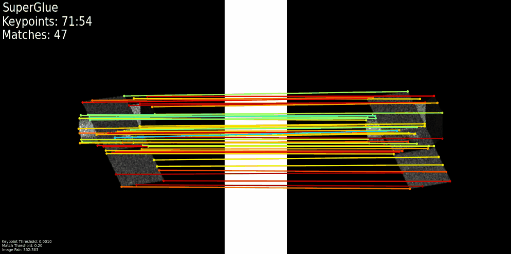
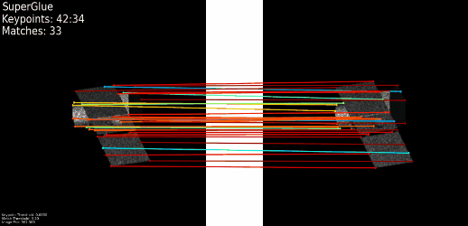
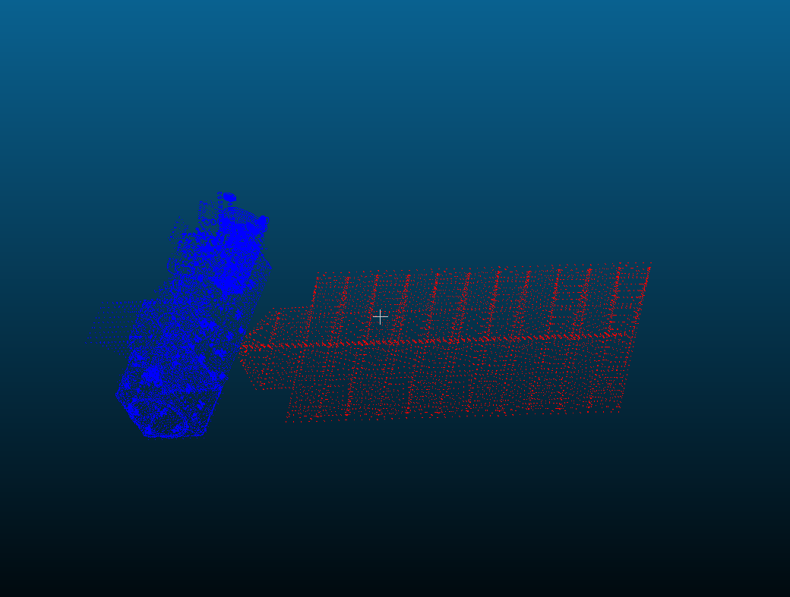

## 5.14周报

### **1. 特征点追踪**

对相邻两图像提取特征点并匹配，计算当前帧与下一帧的**单应性矩阵H**，对当前帧未匹配的特征点乘以**H**，保存为下一次做匹配的特征点，保证当前帧特征点随着图像序列进行而不丢失

| 这周改进效果           | 之前效果                               |
| ---------------------- | -------------------------------------- |
|  |  |

总结：

虽然能保持特征点数量足够且不会丢失，但到匹配的效果变差，原因可能是丢失特征点的描述子没有更新，导致后面误差累积增大。下周再对描述子部分做一些工作

### 2. 三维点云分割

只完成了三维点云的分割，最终目的是想投影到二维图像中能够批量生成对应的掩膜

