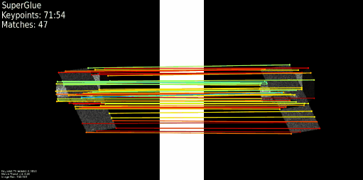
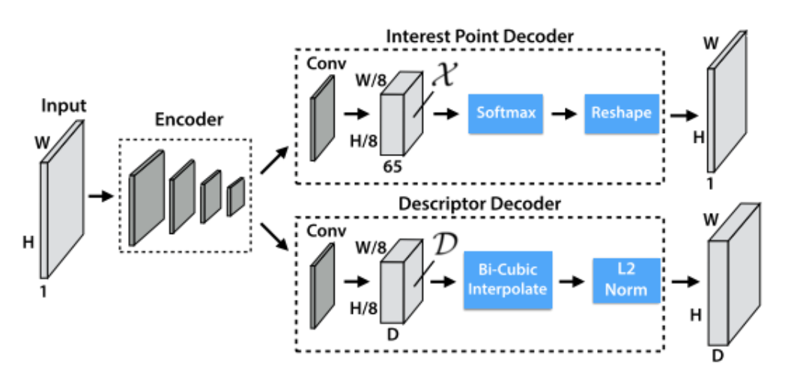

## 5.22周报

#### 特征点追踪

| 本周改进效果               | 上周效果            |
| -------------------------- | ------------------- |
|  |  |

重新审视superglue的源代码，里面是分别有提取**特征点**和提取**描述符**的网络，从第二帧开始，**待匹配特征点**由上一帧的跟踪和计算单应性矩阵H得到，而**描述符**还是继续由网络提取

