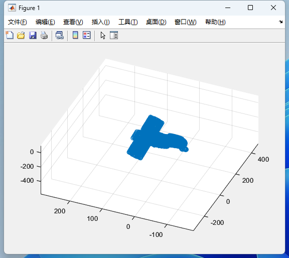
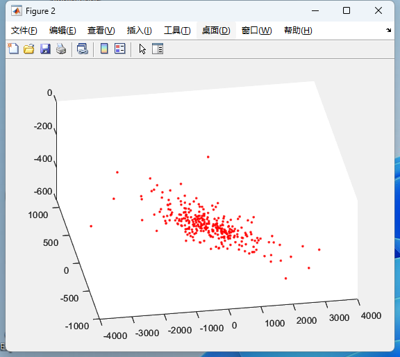
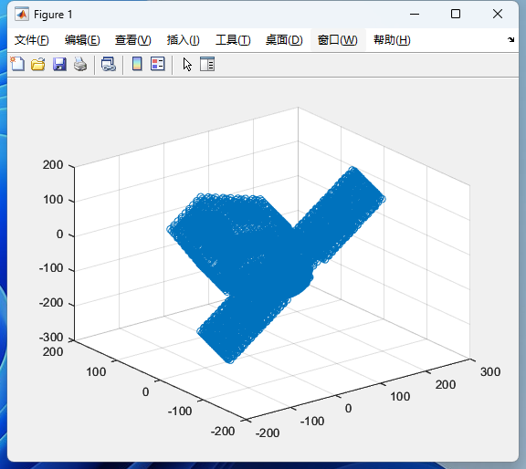
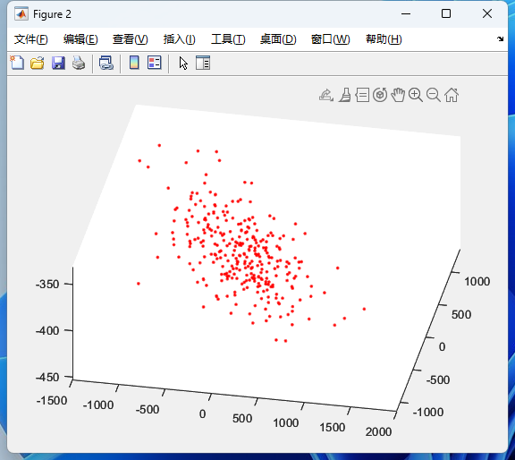

## 5.29周报

**SVD对两个物体重构**

|  |  |
| ------------------------------------------------------------ | ------------------------------------------------------------ |
|  |  |

**现有问题：**

相邻帧的特征点有很多的误匹配

