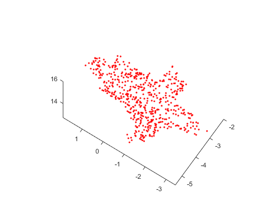

# 6.12周报

**SFM(Structure From Motion) 三维重构**

上周问题：之前用SVD对物体进行三维重构效果不理想

**SFM基本原理：**

> 从两个或者多个视点观察同一景物，已获得在多个不同的视角下对景物的多张感知图像，运用三角测量的基本原理计算图像像素间位置偏差，获得景物的三维深度信息，这一个过程与人类观察外面的世界的过程是一样的。

**所用的图像序列：**

**与上周SVD重建对比**

| SFM                            | SVD                                             |
| ------------------------------ | ----------------------------------------------- |
|  |  |

**现有问题：**

多视图重建，当图像数量增加后，异常点也随着增多

| 3张图像重建                                                  | 4张图像重建                                                  |
| ------------------------------------------------------------ | ------------------------------------------------------------ |
|  |  |

