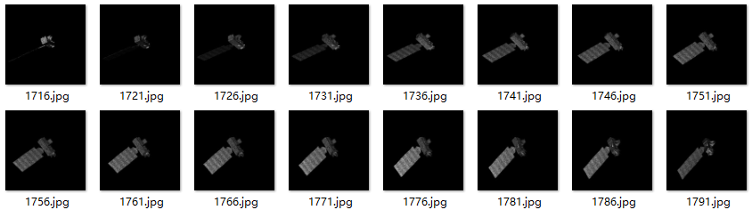
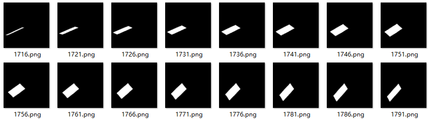
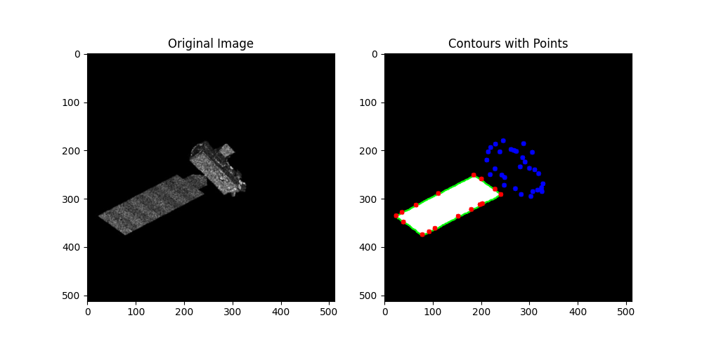
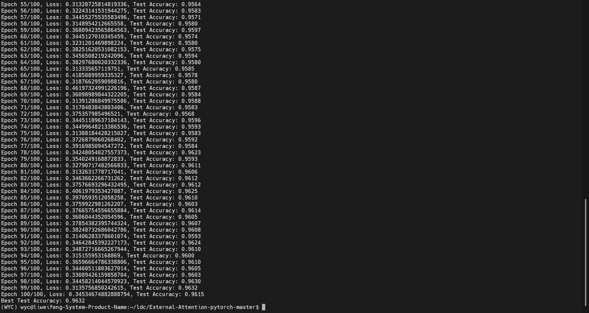

# 周报

### 制作部件的掩码

**source**

**mask**

所提取的特征点，做分类标签，用于后续网络训练的数据集

### 训练特征点分类网络

证明由SuperGlue提取的特征点描述子能够反映目标的边缘、纹理或局部形状特征

| Loss   | Test Accuracy |
| ------ | ------------- |
| 0.3453 | 0.9615        |

