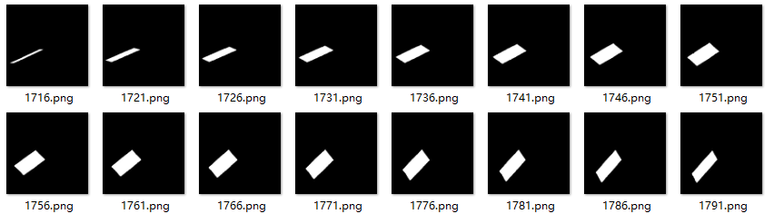
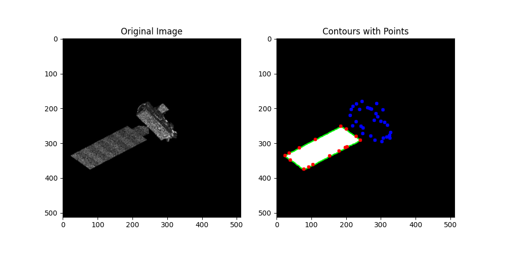
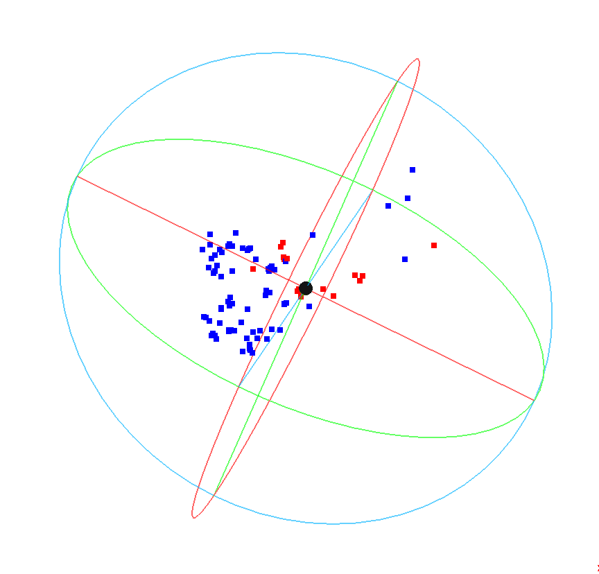
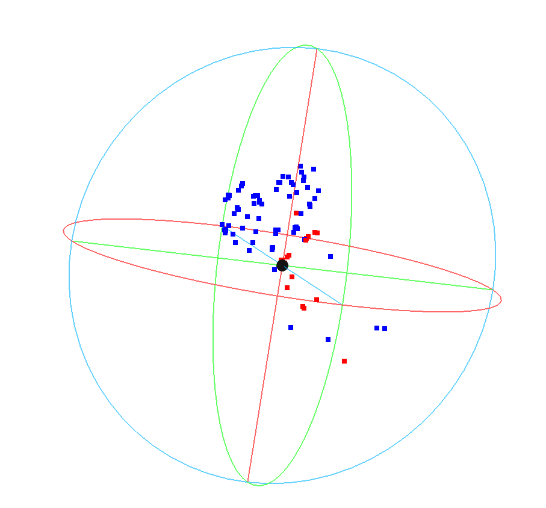

## 7.3

#### **三维重建**

1. 对图像序列进行**SuperGlue**进行特征点提取，提取出的特征点分别对应一个256维的描述子
2. 引入神经网络对提取的特征点进行预测（输入是特征点对应的描述子），数据集标签由如下目标部件掩膜得到

3. 得到预测的部件分类结果后，对特征点进行**sfm**稀疏三维重建。最终得到的目标的三维结构，同时携带目标的部件信息

**三维重建结果：**

|                                                              |                                                              |
| ------------------------------------------------------------ | ------------------------------------------------------------ |
|  |  |

