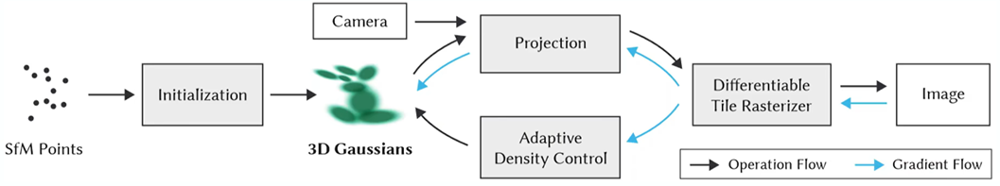
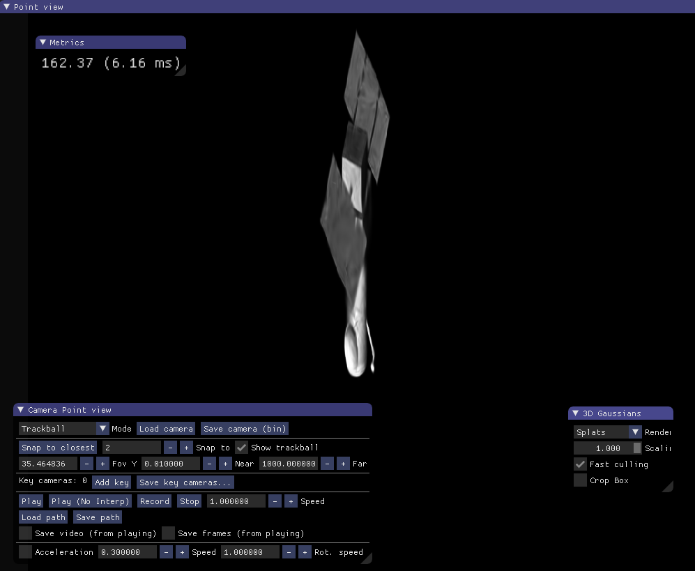
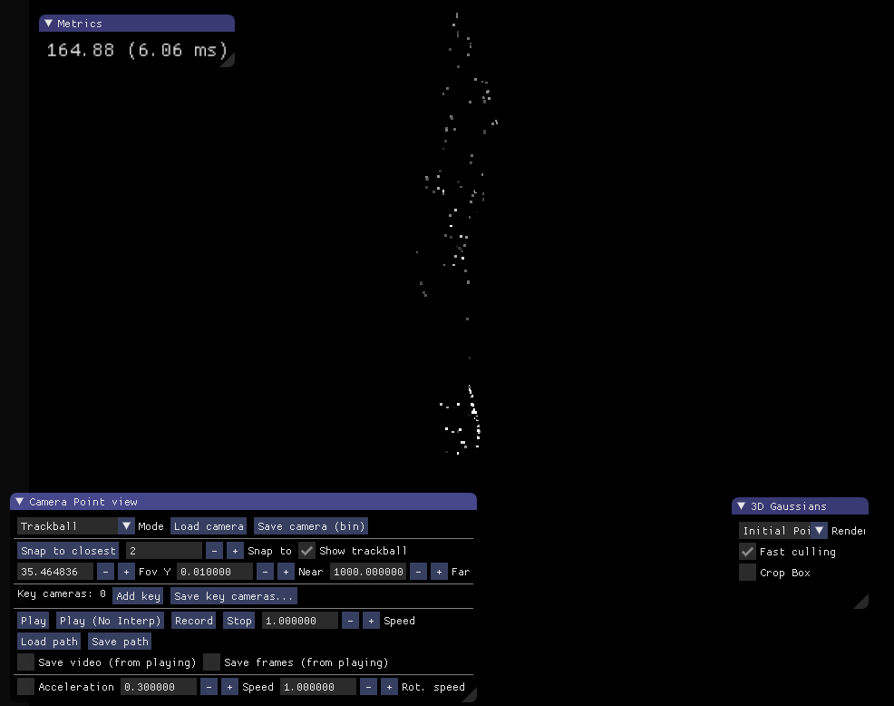
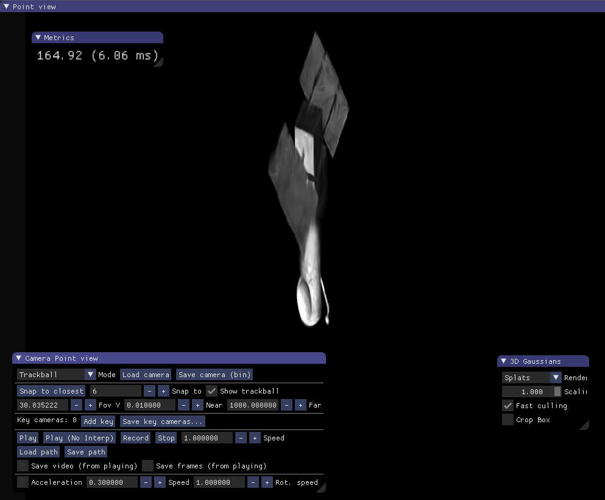
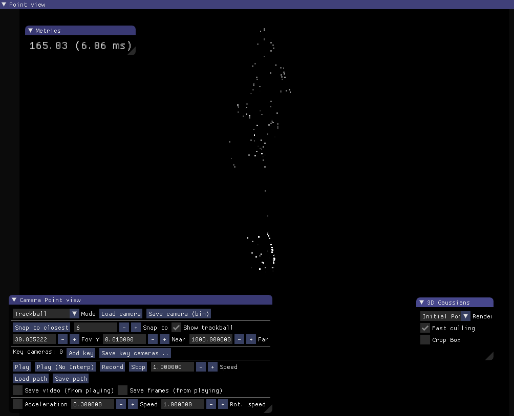

## 8.20周报

**修改数据集**

用自己的数据集跑**3D Gaussian Splatting** ，初始三维点云由colmap来获得

| Ground  True                                                 | 渲染图                                                       | 初始点云                                                     |
| ------------------------------------------------------------ | ------------------------------------------------------------ | ------------------------------------------------------------ |
|  |  |  |
|  |  |  |

**实验结果**

虽然模型训练的L1 loss已经很低，但是渲染出来的效果与真值图差别较大，初步分析的原因是

自己的数据集中图像纹理比较弱，模型输入的点云用的是sift特征点得到，在进行sfm时计算出的稀疏三维点云缺失明显，相机位姿不准确。后面考虑尝试用SuperGlue来做sfm