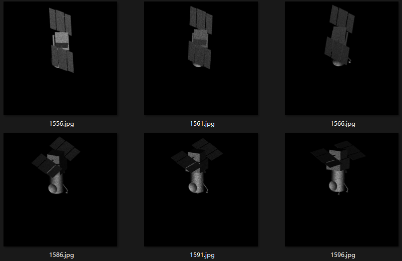
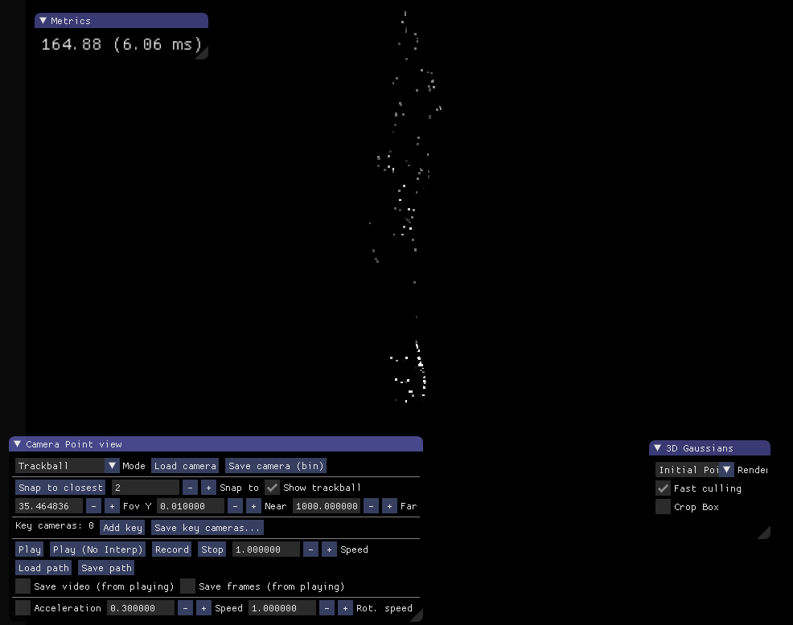
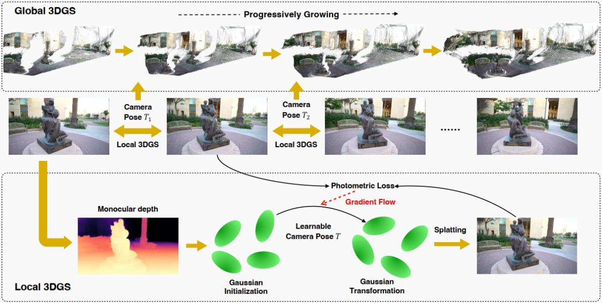

# 09.18

## COLMAP-Free 3DGS

​	问题：训练nerf或3dgs的一个关键步骤是为每张输入图像预先计算相机姿态。而对于我们的数据集，目标缺乏足够的纹理信息，进而图像中可能没有足够被提取的特征点或这些特征点没有被正确地匹配。

| 图片序列                                                     | sfm(colmap)                                                  |
| ------------------------------------------------------------ | ------------------------------------------------------------ |
|  |  |

最近阅读了一篇不需要COLMAP的3DGS投影（CF-3DGS）方法，它利用两个关键因素：视频中的时间连续性和显式的点云表示

目标是学习一个仿射变换，可以将帧t−1中的3D高斯变换到渲染帧t中的像素。神经渲染提供了优化仿射变换的梯度，这本质上是相邻帧t−1和t之间的相对相机姿态

