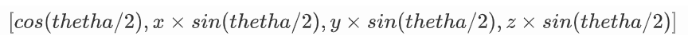
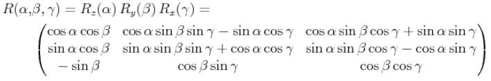
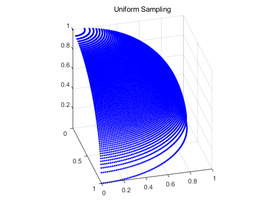
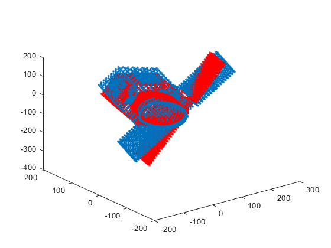
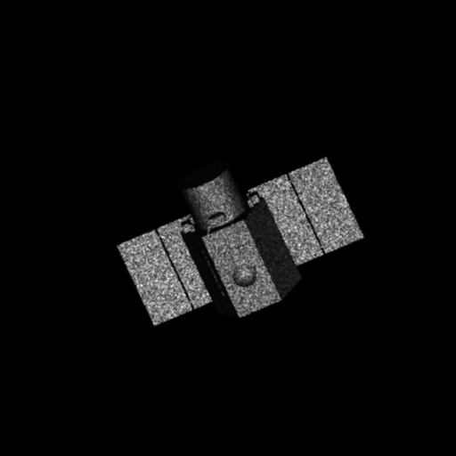
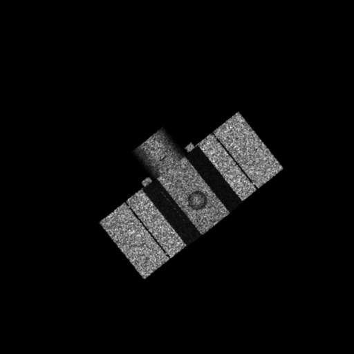

## 09.25

### 光电同视角数据集

### 目标姿态调整

**旋转四元数**

控制三维点云沿某个轴旋转某个角度

例如(x,y,z)是axis方向的单位向量，thetha是绕axis转过的角度

那么四元数可以表示为

四元数与旋转矩阵（相机外参）都是用于表示三维空间中的旋转，二者之间可以一一对应

| M2旋转向量                              | 旋转一定角度的目标点云                  |
| --------------------------------------- | --------------------------------------- |
|         |                 |
|  |  |

