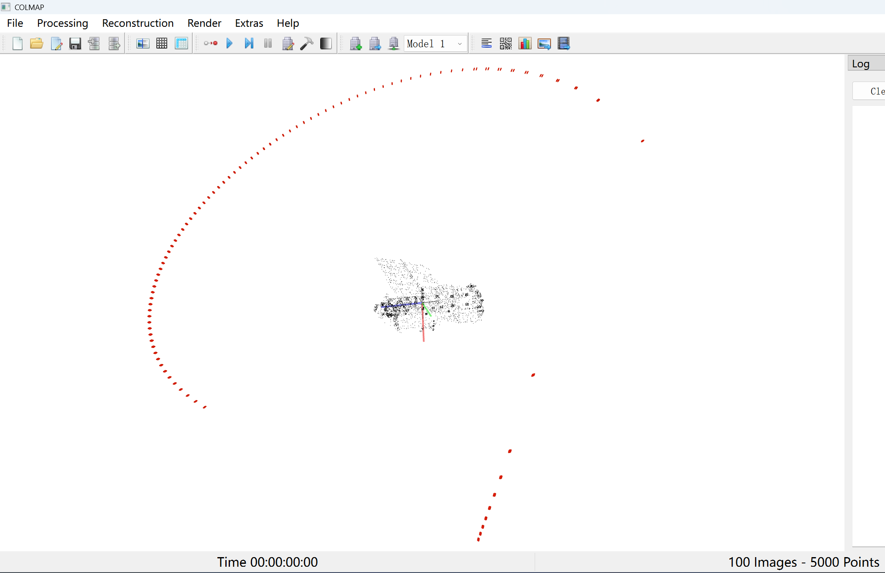
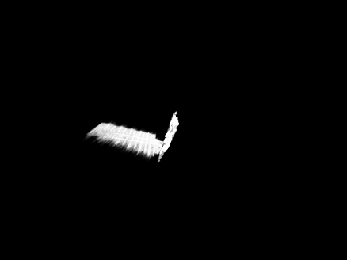
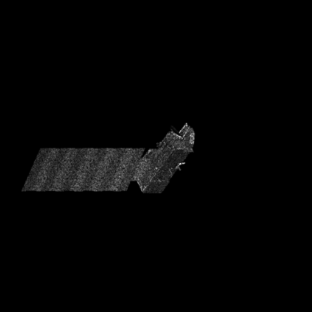

## 10.09

### 本周工作

1. 用现有的点云模型，构建与colmap格式相同的输出数据，同时也就是构建3dgs的数据集

2. 上述的数据集，用3dgs进行实验

   | 渲染结果                                                     | Ground True                                             |
   | ------------------------------------------------------------ | ------------------------------------------------------- |
   |  |  |

   | 数据集 | L1      | PSNR    |
   | ------ | ------- | ------- |
   | Aura   | 0.01273 | 25.5472 |

### 下周工作计划

1. 扩展数据集，换多个目标点云进行实验
2. 根据3DGS实验结果对数据集进行分析，找优化空间
3. 回顾以前的工作，最好能将Superglue与3DGS拼接起来

