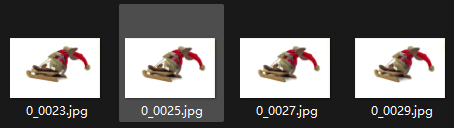
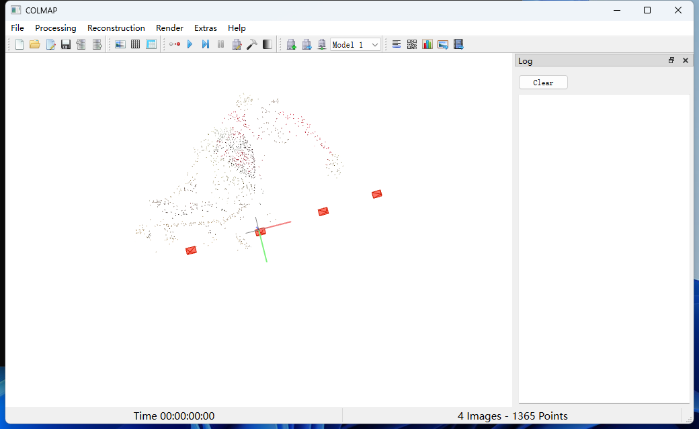
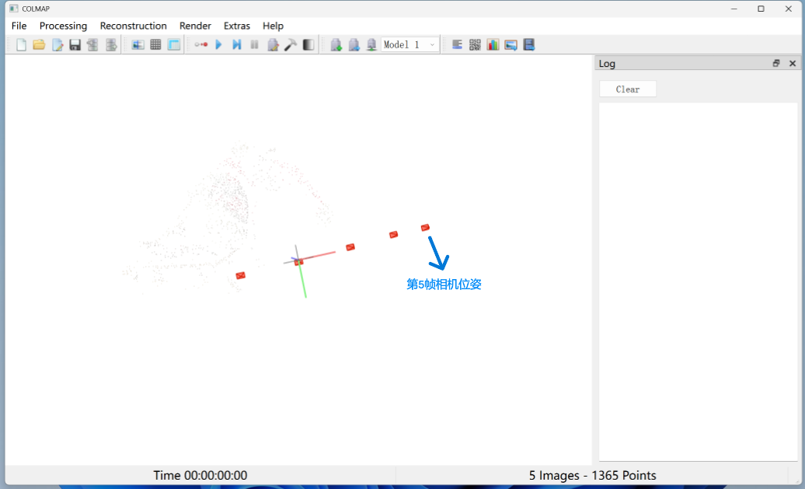
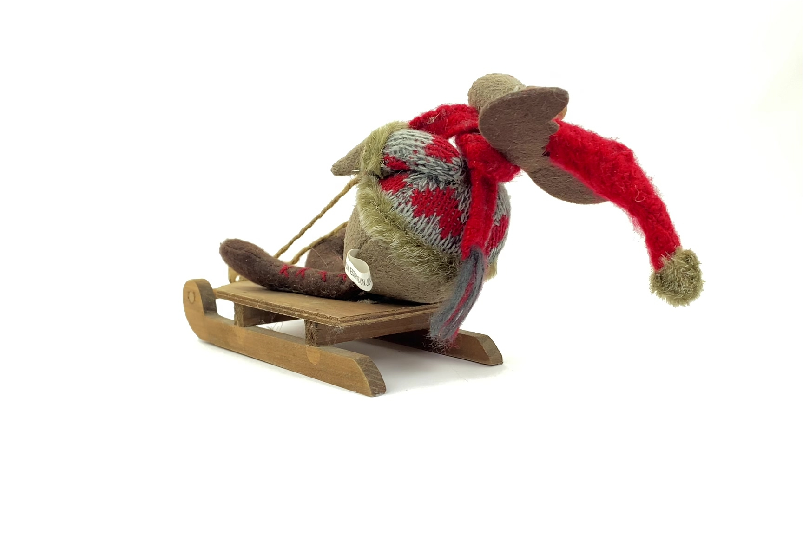
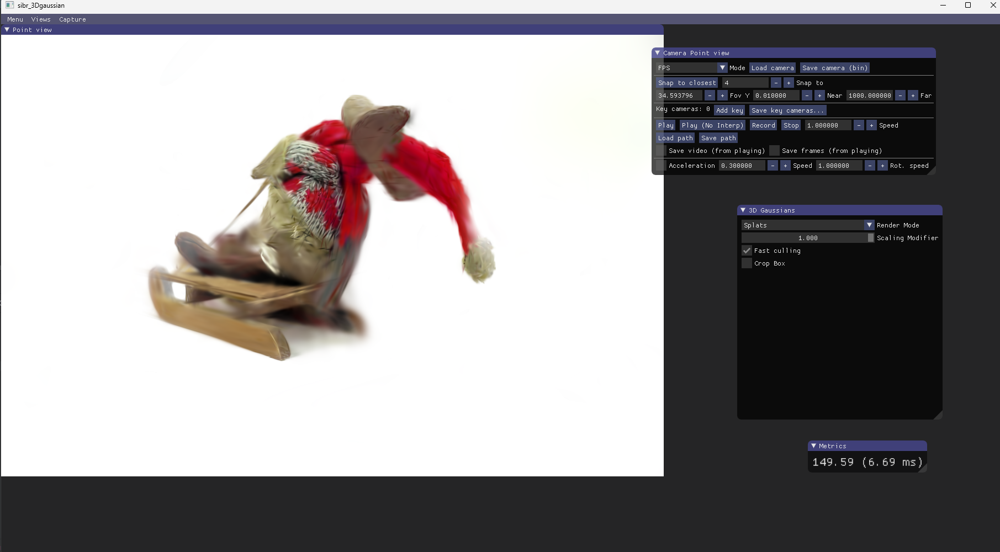

## 10.16

#### 3DGS从已有帧的相机位姿，估计下一帧相机位姿下的渲染

前四张真实图像

| 四张图像对应的相机位姿                                       | 第五张图像对应的相机位姿                                     |
| ------------------------------------------------------------ | ------------------------------------------------------------ |
|  |  |

**实验结果**

| 真实图像               | 渲染图                                                       |
| ---------------------- | ------------------------------------------------------------ |
|  |  |

