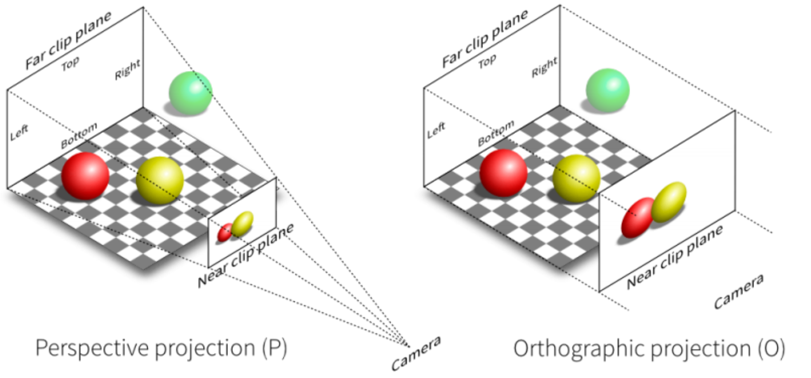

## 10.23

**自身数据集应用于3dgs模型**

1. 首先认识到问题的核心在于3dgs要求的透视投影相机内参模型与自身数据集的正交投影不匹配。

2. 考虑通过数学方法进行拟合，尝试了**线性最小二乘法**和**非线性最小二乘法**，期望将**正交投影**拟合成**透视投影**，从而使数据集能够适应项目要求。

3. 拟合方法效果不佳，决定从项目源码入手，尝试修改透视投影部分为正交投影，以实现项目与数据集的兼容。

   

**现有结果**

已经完成了对项目源码的修改，并正在进行进一步的测试和优化。虽然还不能确定最终的结果是否完全符合预期，但初步显示，修改后的源码在一定程度上能够应用于自身数据集。

