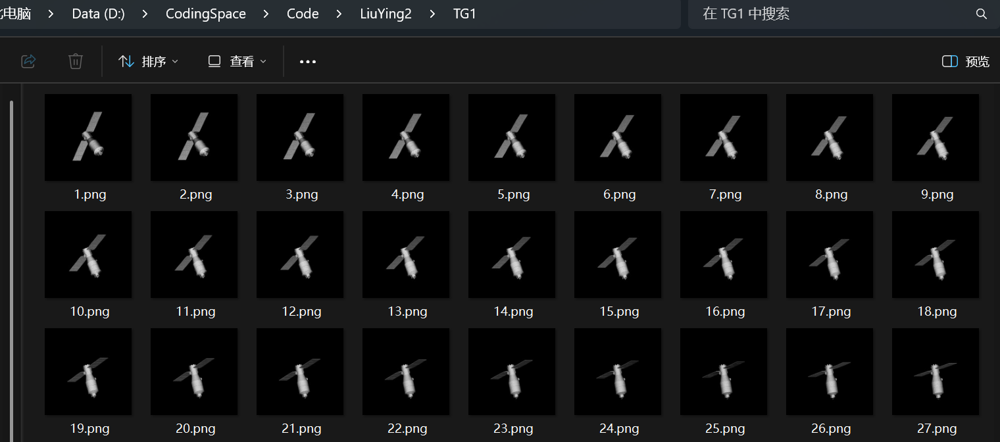
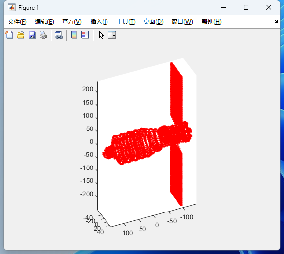
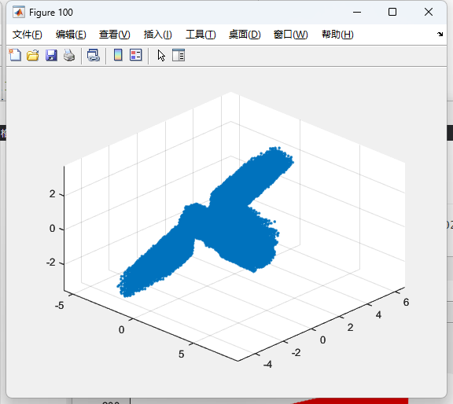
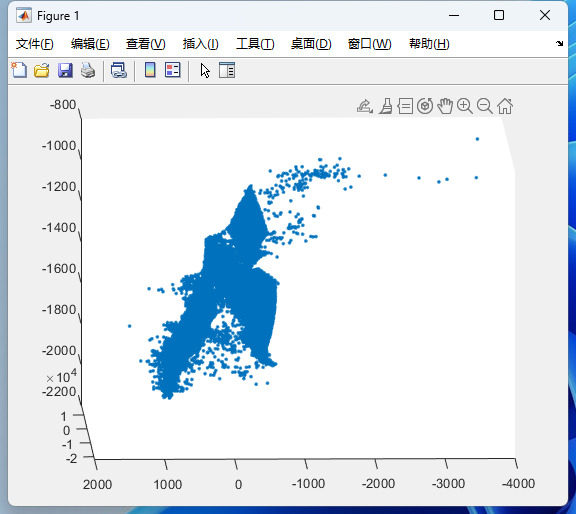

## 12.05

重新整理之前做的**逆投影**和**SVD**三维重建两种方法，并用自己的数据跑了一组**TG1**目标的光学图像

| 真实点云                                                     | 逆投影三维点云                          |
| ------------------------------------------------------------ | --------------------------------------- |
|  |  |

**SVD重建点云**

后面打算融合两种方法，通过**点云配准**生成完整点云，最后再加一些**部件分割**的内容作为我的开题方向