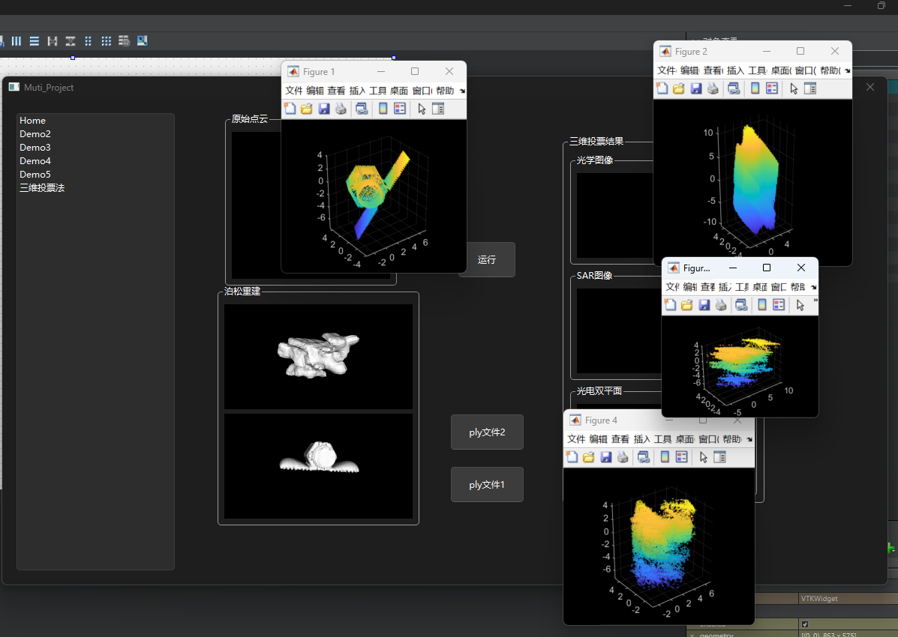
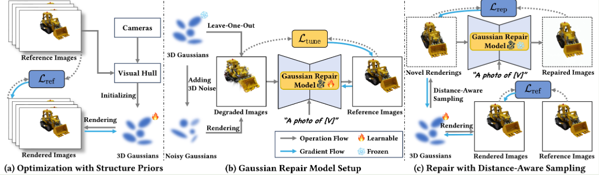

### 3.4周报

#### QT集成三维投票法

目前完成对三维投票法的进程调用，QT与此Matlab项目之间的数据交互逻辑，但是可能是mat文件与PCL库之间转换存在问题，输出结果无法在嵌入在主界面中，只能先用matlab中的库函数可视化出来

#### 3DGS相关项目

##### GaussianObject: High-Quality 3D Object Reconstruction from Four Views with Gaussian Splatting [[code]](https://github.com/chensjtu/GaussianObject) [[paper]](https://arxiv.org/abs/2402.10259)

技术背景：

稀疏视图下的3D重建具有挑战性，尤其是仅使用四张图像时，多视角一致性难以构建

方法创新：

COLMAP-free，无需精确相机参数，适用于更广泛的实际应用场景，正好能够解决目前我出现数据集相机外参对不准的问题

