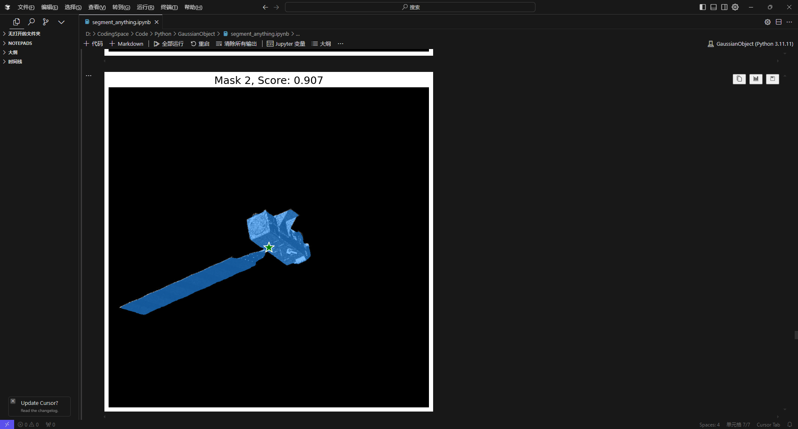
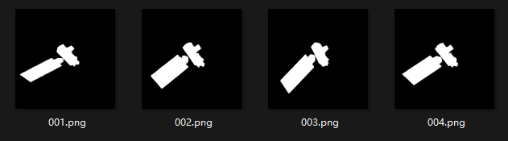
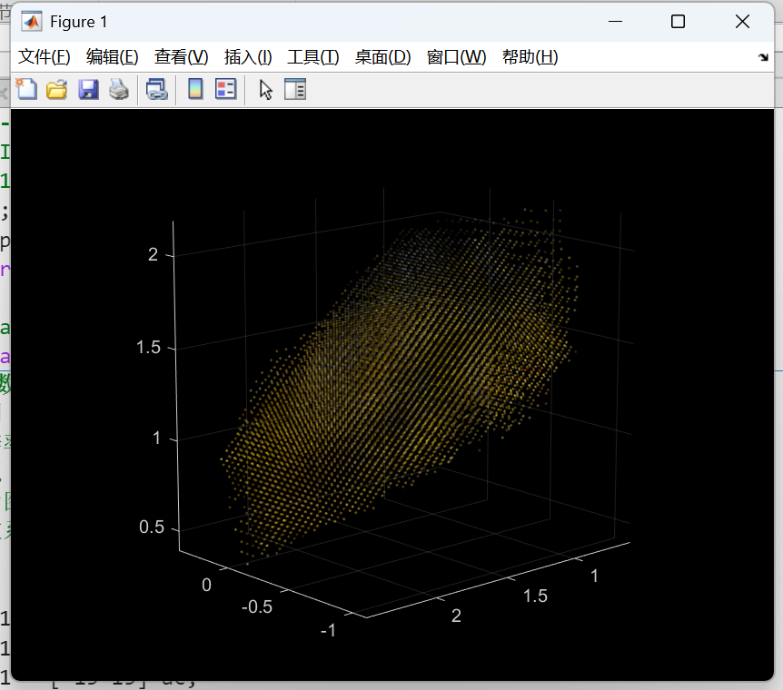
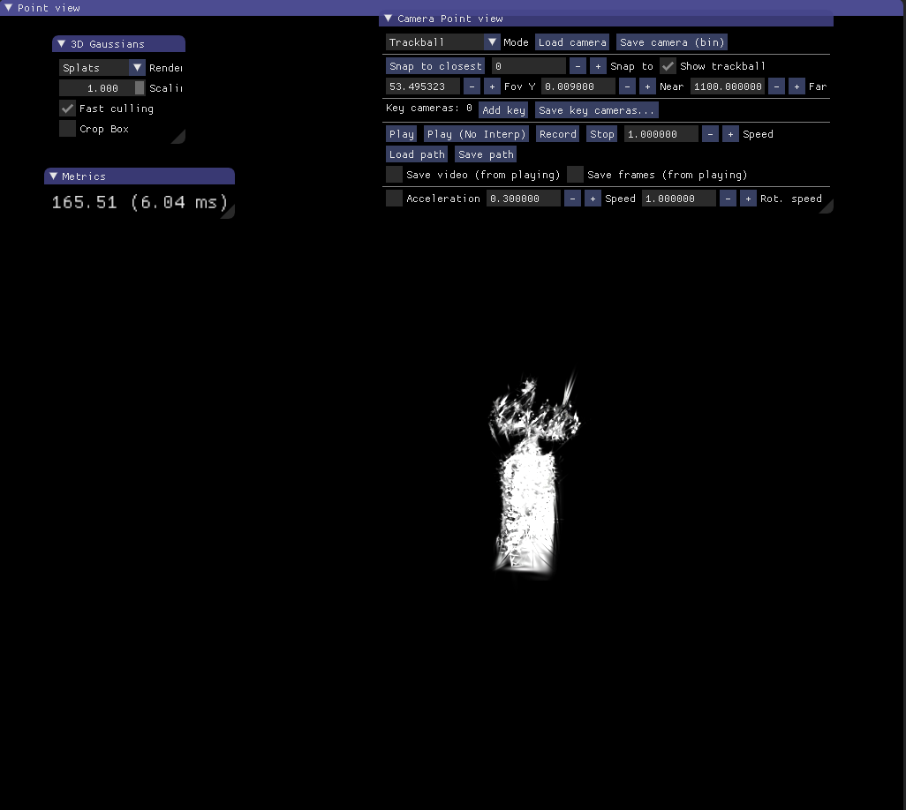
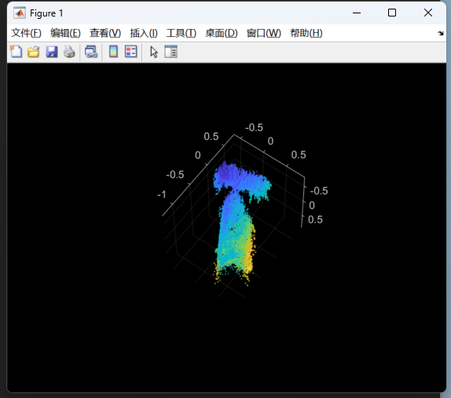

## 3.11

##### 复现

##### GaussianObject: High-Quality 3D Object Reconstruction from Four Views with Gaussian Splatting

仅通过四视图，进行高质量的3D高斯重建，解决之前数据集相机模型的问题。

1. 先用SAM大模型对图像序列进行分隔，获得目标掩膜

|                                                              |                                                              |
| ------------------------------------------------------------ | ------------------------------------------------------------ |
|  |  |

2. 利用掩膜和现有的深度估计模型DUSt3R初始化三维高斯点云

3. 最后放进论文所述的模型中训练，生成相应的渲染图和三维点云

   |                                                              |                                                              |
   | ------------------------------------------------------------ | ------------------------------------------------------------ |
   |  |  |

   

