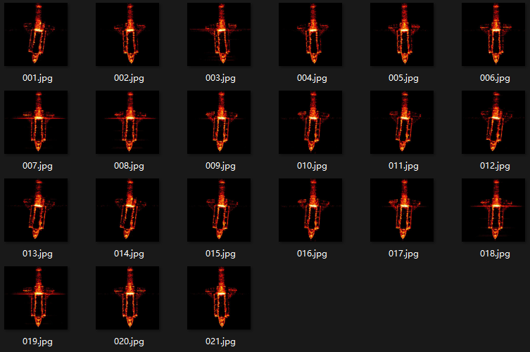
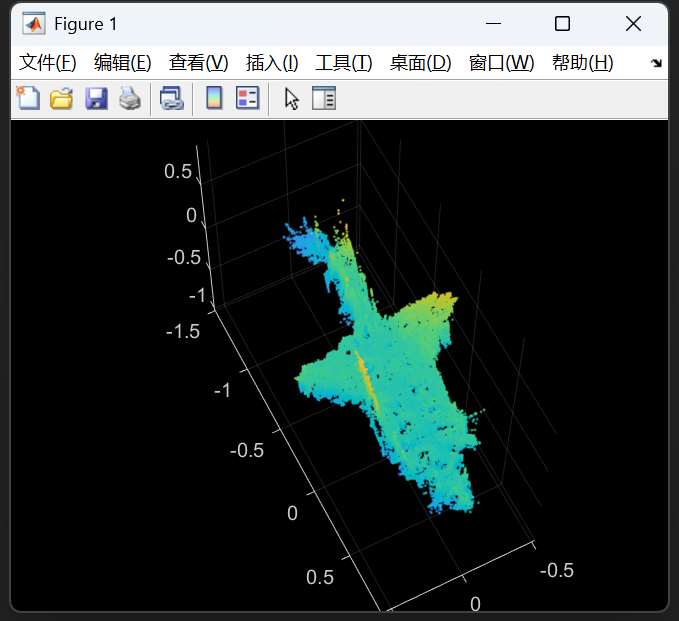
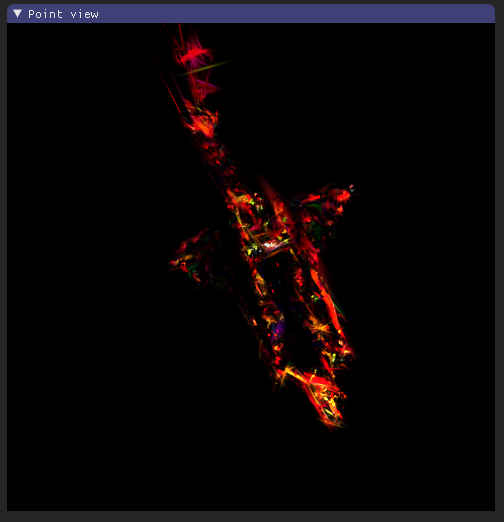

## 03.17周报

用GaussianObject跑shutter4数据集

**结果分析**

在特定的视角下具有比较好的视觉效果

| 重建后的三维点云                                             | 渲染结果                                                     |
| ------------------------------------------------------------ | ------------------------------------------------------------ |
|  |  |

