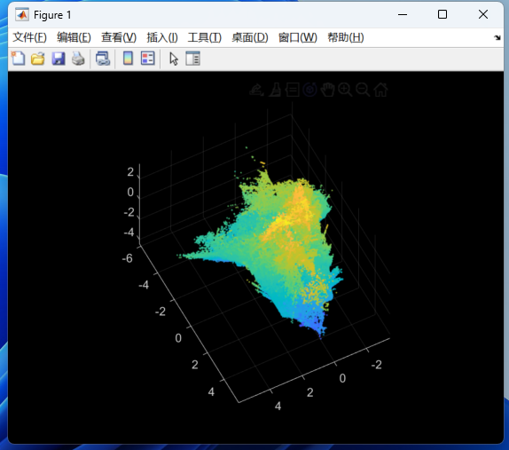
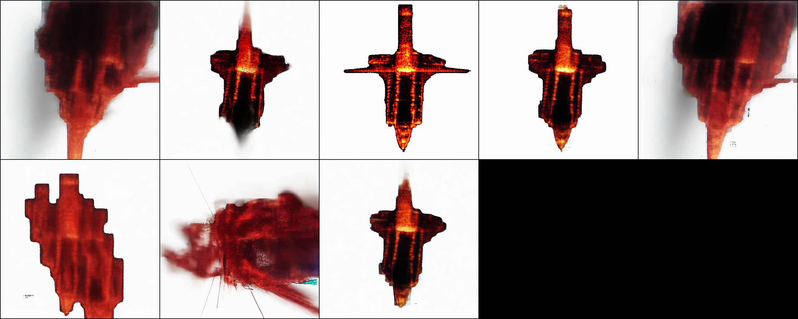
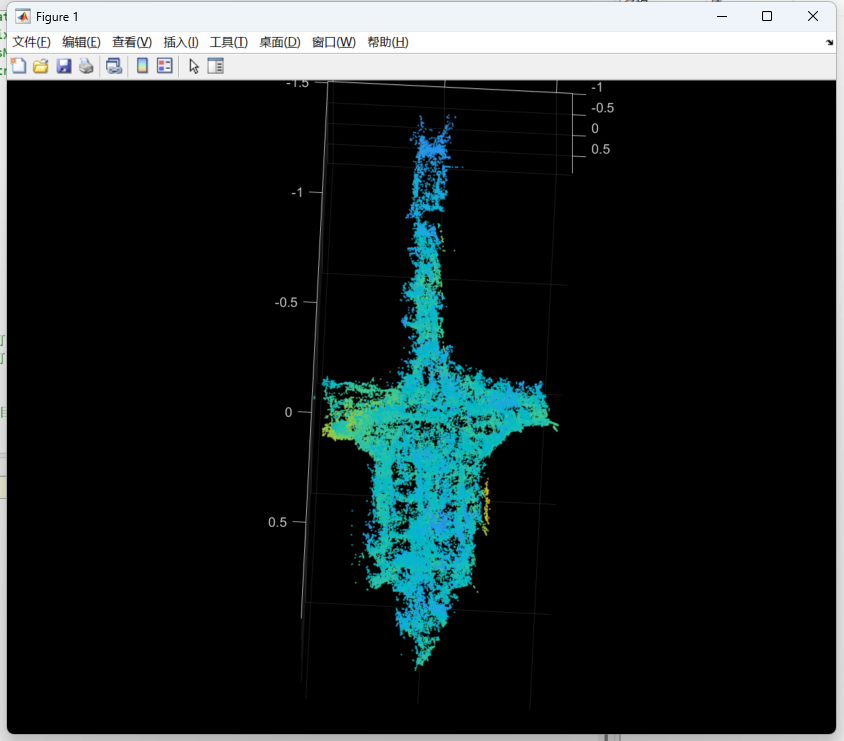
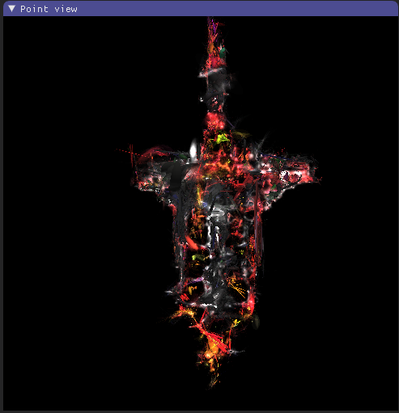

# 03.24

本周主要对 `GaussianObject` 的三大模块（**Dust3R**、**ControlNet+Diffusion**、**3DGS**）进行代码测试、验证模块功能每一步的可视化中间结果

### **Dust3R**

由四个视图初始化的三维点云，作为后续用于3DGS点云的输入

### **Controlnet+Diffusion**

经过训练后的修复模型，将一个未知视角下渲染出的**退化图像**，经过若干步预测噪声的过程，生成高质量的**修复图像**

### **3DGS**

利用生成的图像对，重新渲染3D场景，得到较完整的点云和渲染场景

|                                                              |                                                              |
| ------------------------------------------------------------ | ------------------------------------------------------------ |
|  |  |

