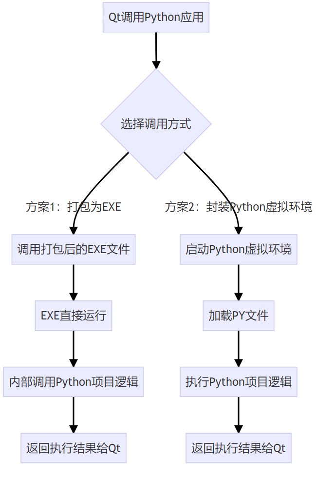

# 04.06

**学习打包Python环境的两种方案**

**两种方法对比：**

|                  | **方案1：打包为EXE**                | **方案2：封装Python虚拟环境**          |
| ---------------- | ----------------------------------- | -------------------------------------- |
| **用户环境依赖** | 无需Python环境，直接运行EXE         | 需要Python虚拟环境（由Qt程序自动管理） |
| **初始体积**     | 较小（单个EXE约100-500MB）          | 较大（虚拟环境约2-10GB）               |
| **扩展性**       | 每次扩展需新增EXE文件，体积增长很快 | 只需添加PY文件，体积增长极小           |
| **维护成本**     | 每次修改需重新打包EXE               | 直接修改PY文件，无需重新打包           |
| **启动速度**     | 较慢                                | 稍快                                   |
| **代码安全性**   | 较高（EXE逆向难度大）               | 较低（PY文件明文存储）                 |
| **适用场景**     | 功能稳定、更新频率低的小型项目      | 功能迭代频繁、需要灵活扩展的中大型项目 |
