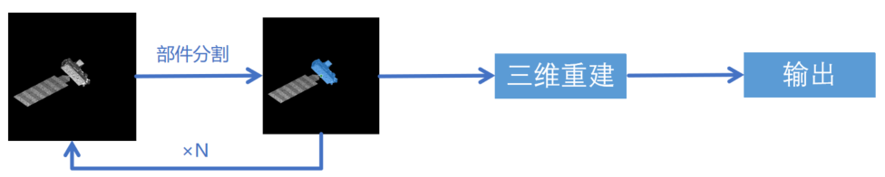

## 04.18

### 通过分割模型对空间目标的部件进行三维的分割场景重建

对Aura图像序列进行部件分割，得到目标部件的分割掩码，整合原图像与分割掩码，作为3DGS的数据集，这周完成部件分割数据集的构建

**本周任务：**

训练上图的3DGS进行三维重建，期望输出的3D高斯模型会隐含携带目标的部件信息（通过颜色区分），目前还在调试二分类的三维重建，验证思路的可行性，下一步需要进一步优化，考虑多分类等

