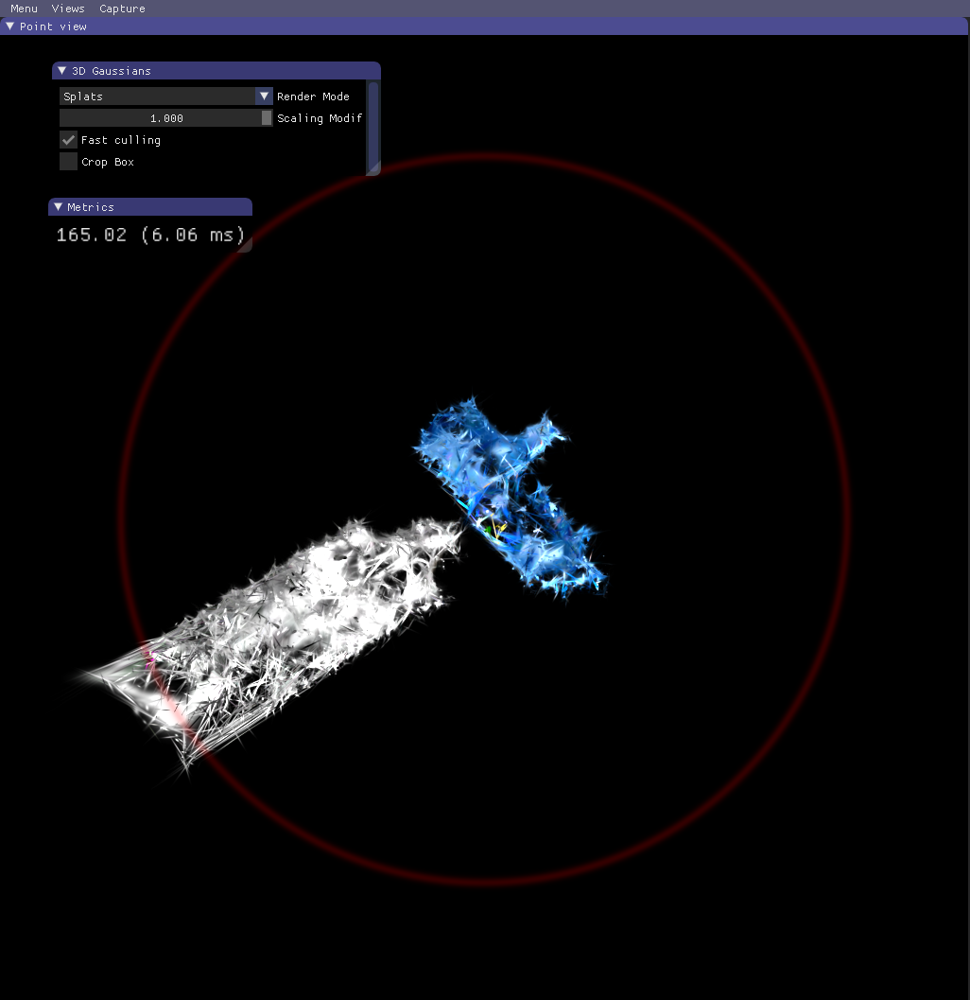

## 4.21周报

**本周工作：2D Mask 映射到3D的三维重建**

对图像序列**SfM**初始化三维点云

调试**SAM**，对每张训练图像生成分割图像，最后参与到**3DGS**的训练中，得到分割**3D模型**

| 加入训练的分割图像                                           | 重建的三维目标（效果）                                       |
| ------------------------------------------------------------ | ------------------------------------------------------------ |
|  |  |

