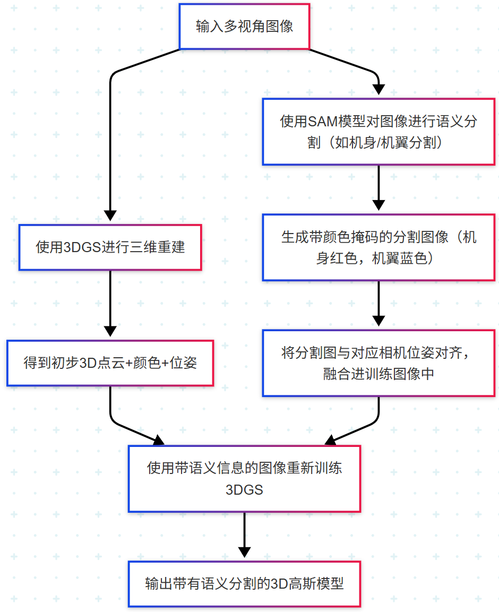
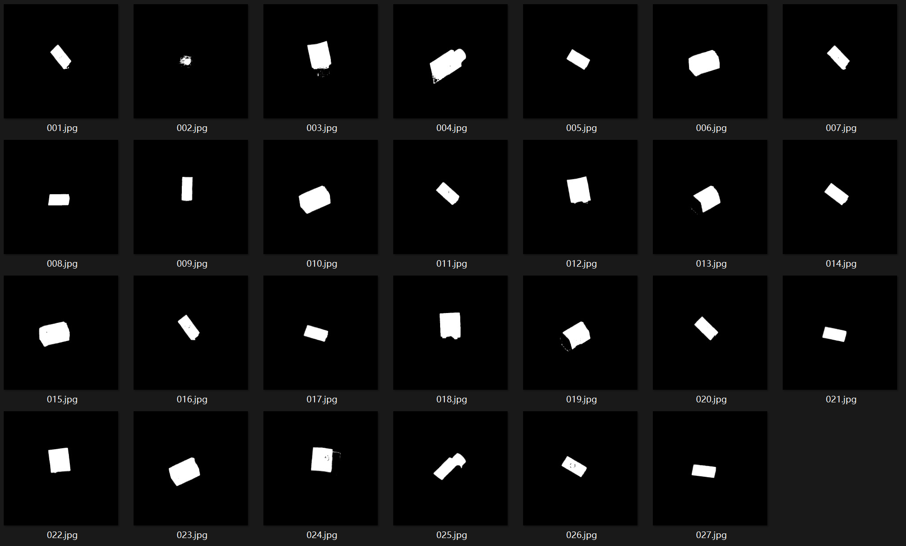
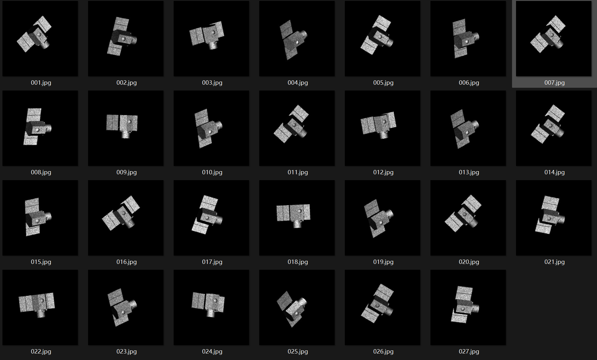
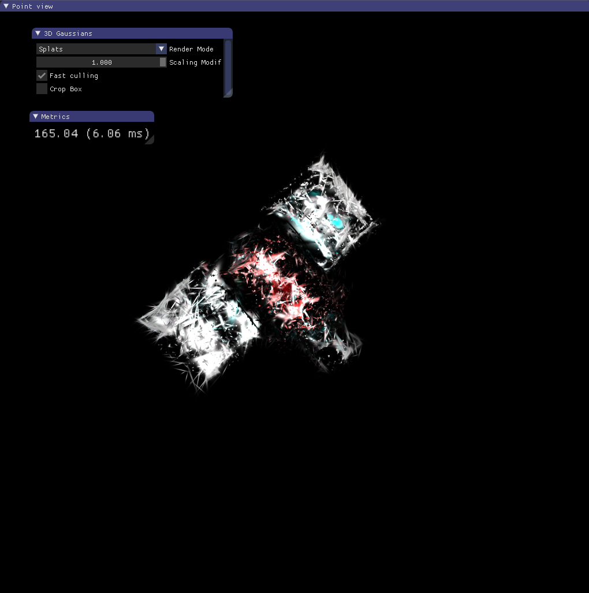
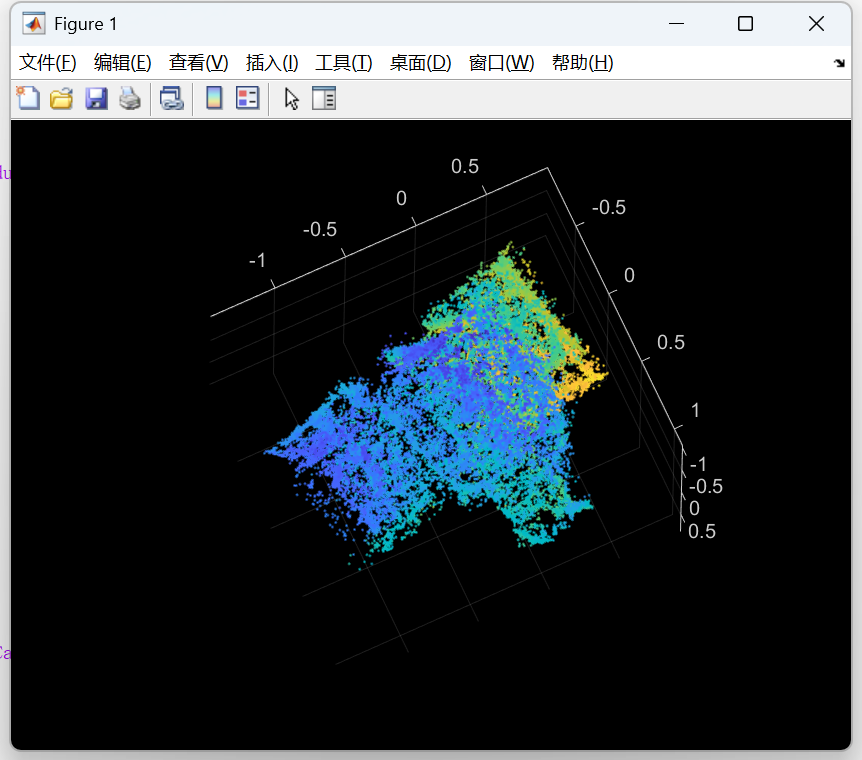
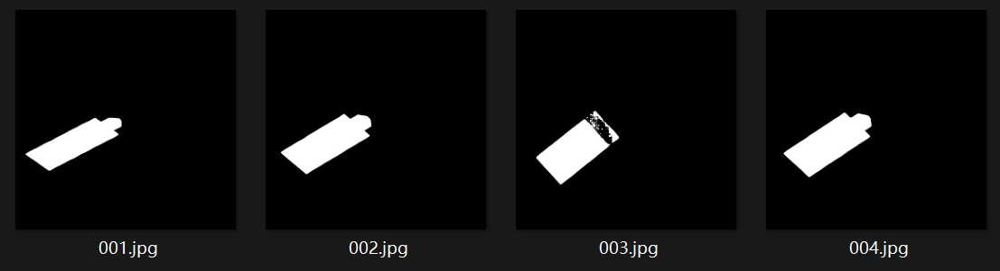
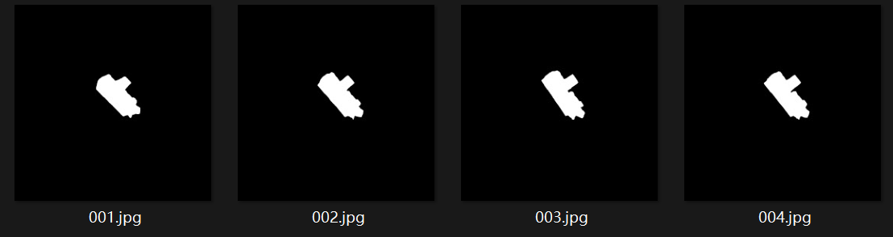
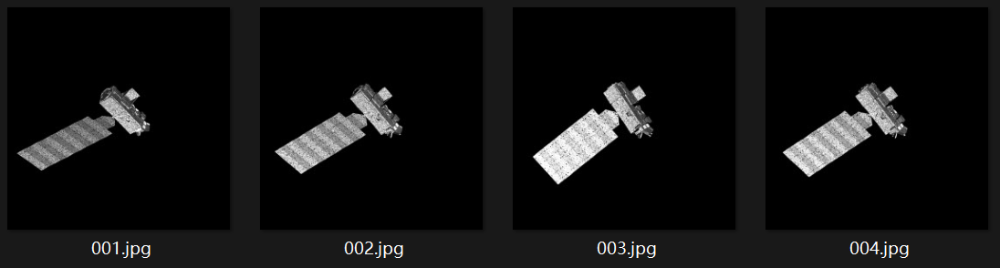
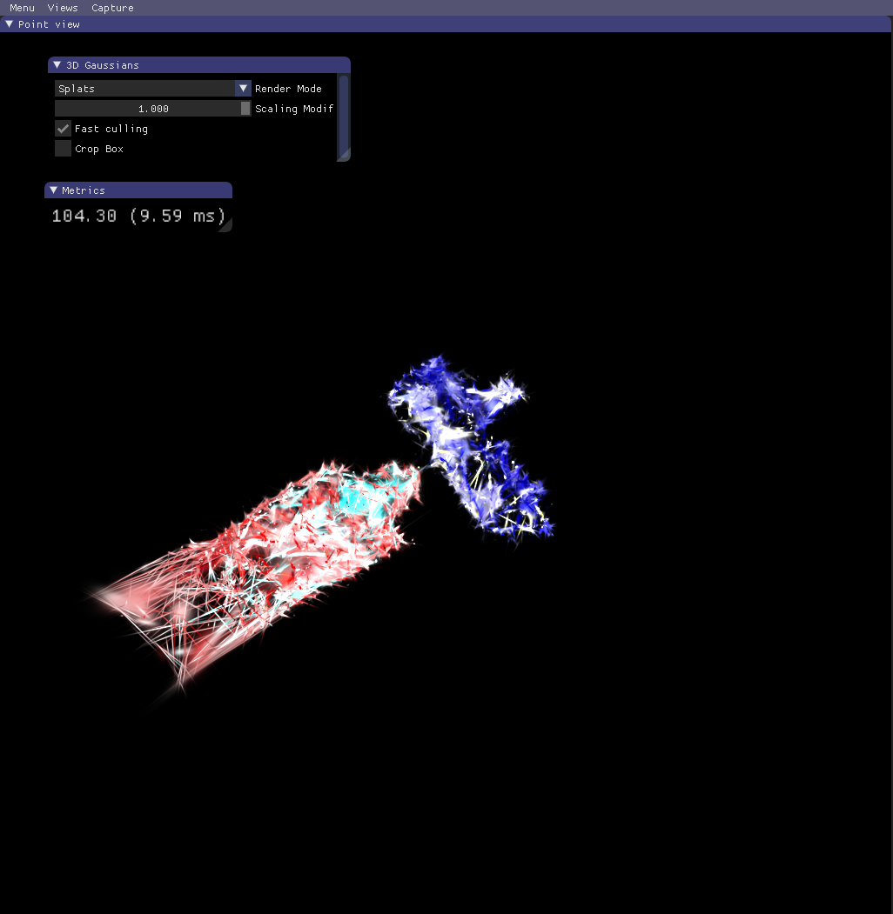
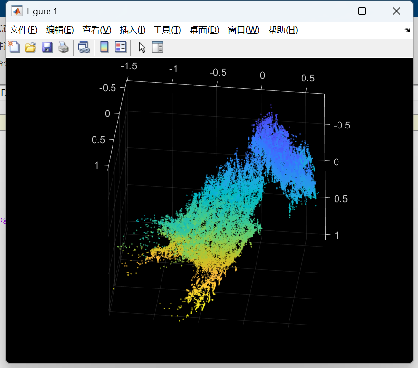

# 05.09周报

#### 1.三维分割重建流程图

#### 2.单部件三维分割

对**Cartography**目标的机身分割标注，在初始重建具有初始点云的情况下，将分割图像加入3DGS中进行重训练，渲染得到带有分割语义的3D场景

| 机身分割掩码                                                 | 原始图像                                                     |
| ------------------------------------------------------------ | ------------------------------------------------------------ |
|  |  |

**重建分割结果：**

| 三维渲染结果                                                 | 重建三维点云坐标                                             |
| ------------------------------------------------------------ | ------------------------------------------------------------ |
|  |  |

#### 3.多部件三维分割

对**Aura**目标的机身和机翼进行分割标注，在初始重建具有初始点云的情况下，将分割图像加入3DGS中进行重训练，渲染得到带有分割语义的3D场景

| 机翼分割掩码                                                 | 机身分割掩码                                                 |
| ------------------------------------------------------------ | ------------------------------------------------------------ |
|  |  |
| **原始图像**                                                 |                                                              |
|  |                                                              |

**重建分割结果：**

| 三维渲染结果                                                 | 重建三维点云坐标                                             |
| ------------------------------------------------------------ | ------------------------------------------------------------ |
|  |  |

#### 4.下周计划

在使用SAM分割图像时，使用的是手动标注的部件坐标点

期望能在分割部分加上部件的**关键点检测**，自动获取部件**关键点坐标**，以得到更精确的部件分割掩码

