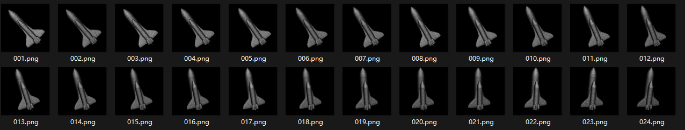
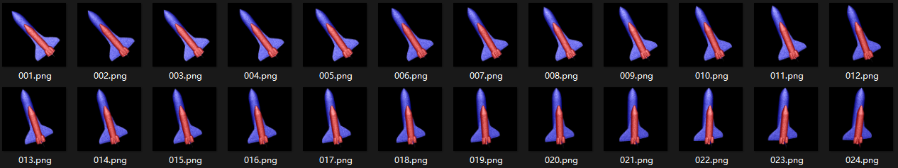
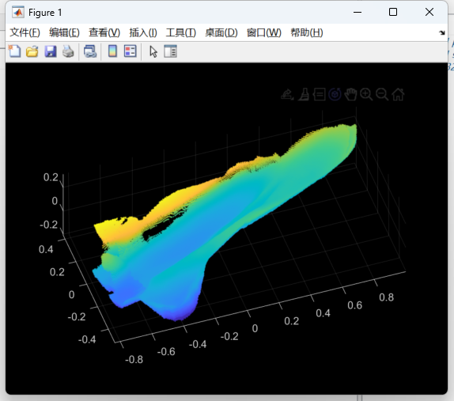
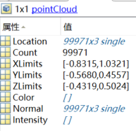
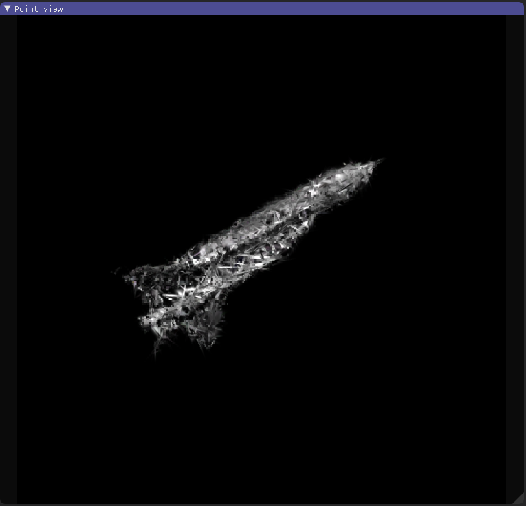
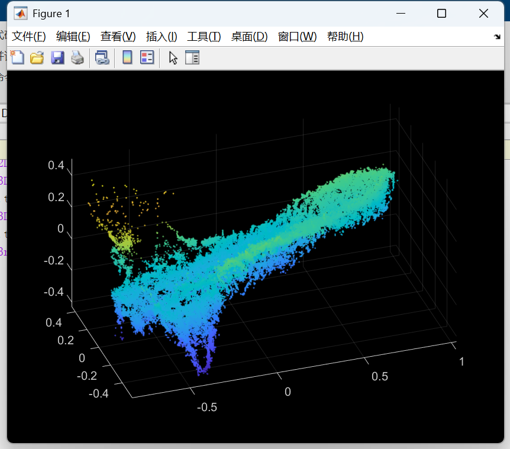
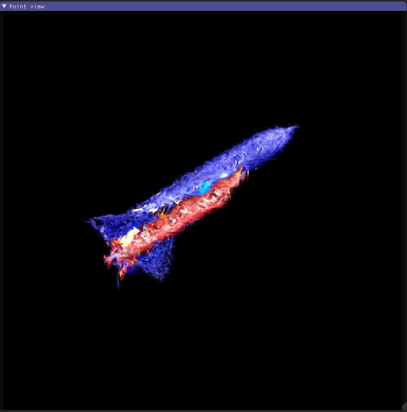
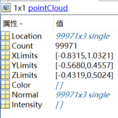
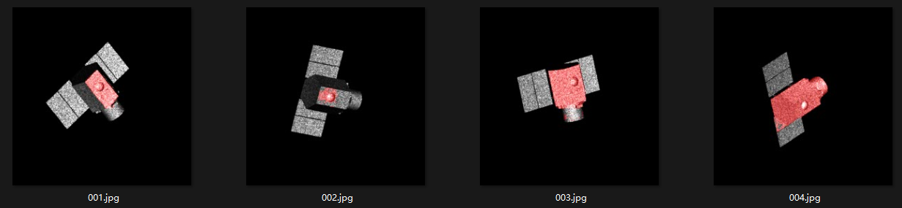
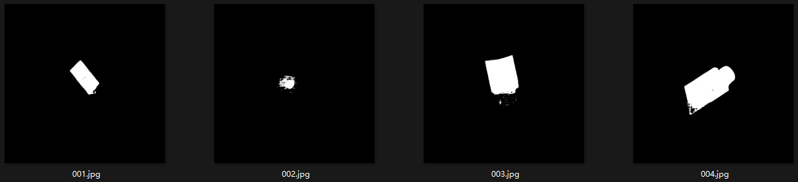

# 05.14

#### 3DGS在 shuttle1目标上的重建与实时渲染表现

**原始图像序列**

#### **1.数据准备：**

​	首先用原图像序列初始化三维点云，之后使用SAM模型对多视角图像进行目标部件（如机翼、机身）分割，生成掩码后将其按类别以不同颜色（如红色表示机身，蓝色表示机翼）融合到原图上，最终将带有语义颜色的图像作为输入用于3D Gaussian Splatting的重训练，从而实现语义分割的三维场景重建

**分割图像序列**

| 初始三维点可视化                                             | 初始三维点参数                                               |
| ------------------------------------------------------------ | ------------------------------------------------------------ |
|  |  |

#### 2.现有结果：

| 渲染结果                                                     | 渲染后三维点可视化                                           |
| ------------------------------------------------------------ | ------------------------------------------------------------ |
|  |  |
|  |  |

> 渲染图像与真实图像的平均误差指标如下：

|   L1    |   PSNR   |
| :-----: | :------: |
| 0.01342 | 26.80038 |

#### 3.问题分析

SAM是提示驱动的掩码预测，由于目前只有单个**坐标点**点击的提示，分割生成掩码精度不理想稳定

**解决方案：**

一个点只能提供非常有限的位置和上下文信息，如果采取关键点回归的方案，提取单个目标的多个部件关键点，再进行SAM分割，生成更精细的掩码

