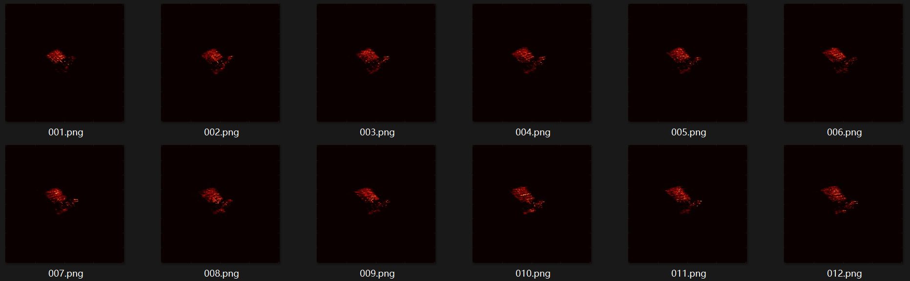
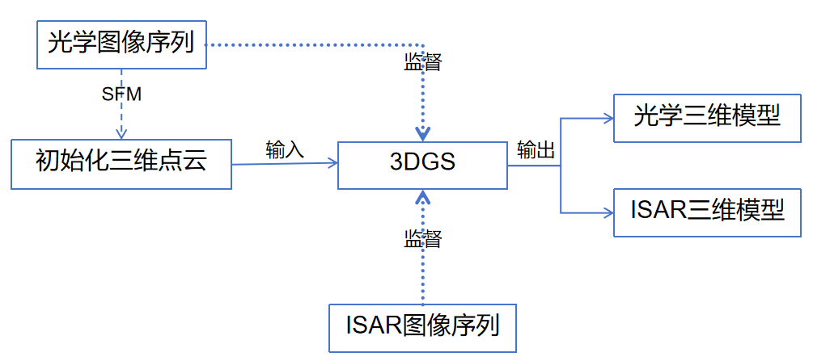
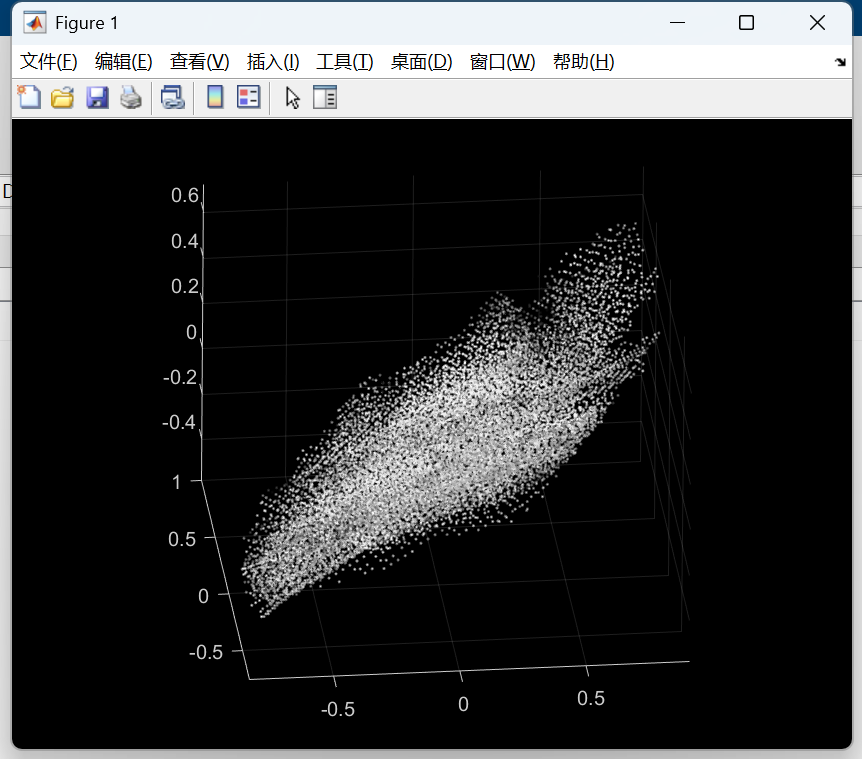
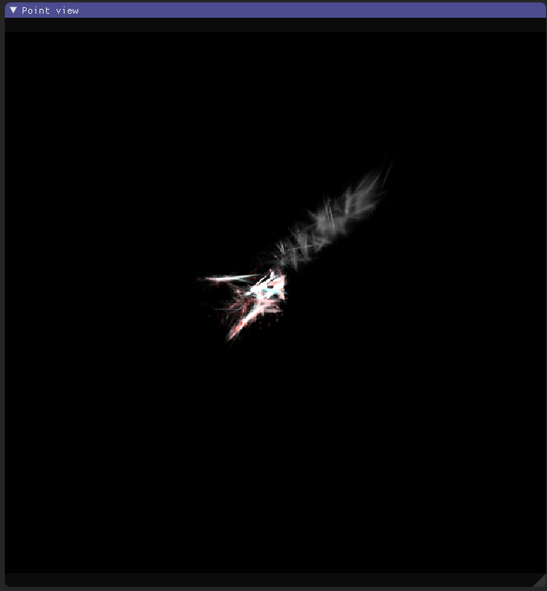
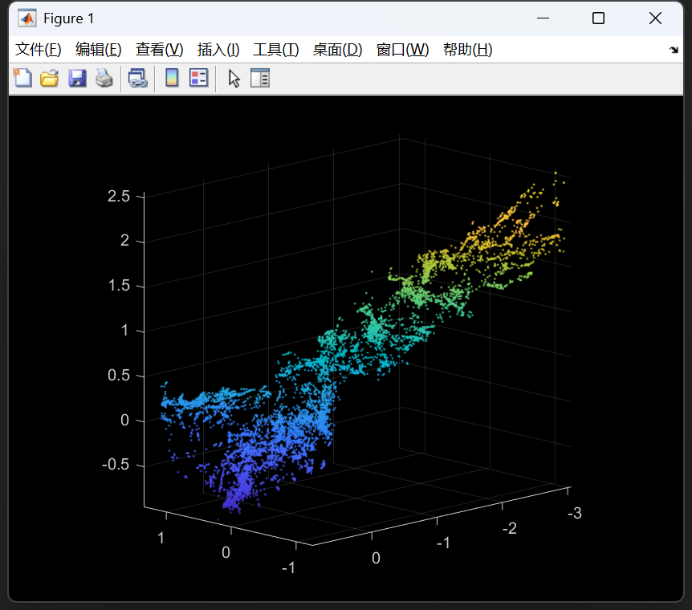
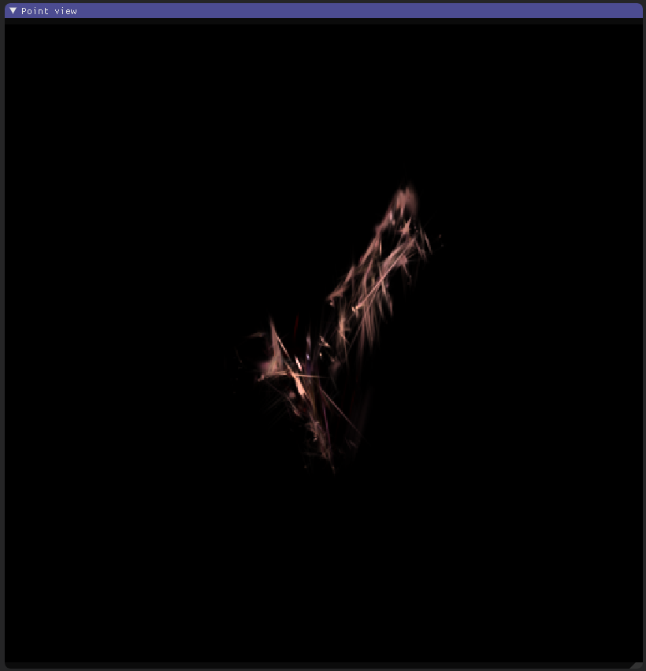
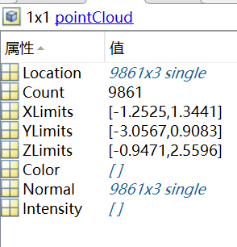

# 05.20

### 本周工作

#### 1.分别对Aura目标进行三维重建（光学和ISAR）

|  |
| ------------------------------------------------------------ |
|  |

#### 遇到的问题：

**ISAR图像质量差**：雷达图像模糊、噪声大，直接用ISAR序列初始化3D高斯点云效果很差（点云太稀疏或根本无法初始化）。

#### 解决方案：

1. 用光学图像初始化点云（光学图像清晰，容易重建出基础形状）

2. 再把ISAR图像作为3DGS训练的输入

#### 现有结果

1. 光学三维场景模型

2. ISAR三维场景模型

**光学图像序列初始化三维点云结果**

| 渲染结果                                                     | 渲染后三维点可视化                                           |
| ------------------------------------------------------------ | ------------------------------------------------------------ |
|  |  |
|  |  |

