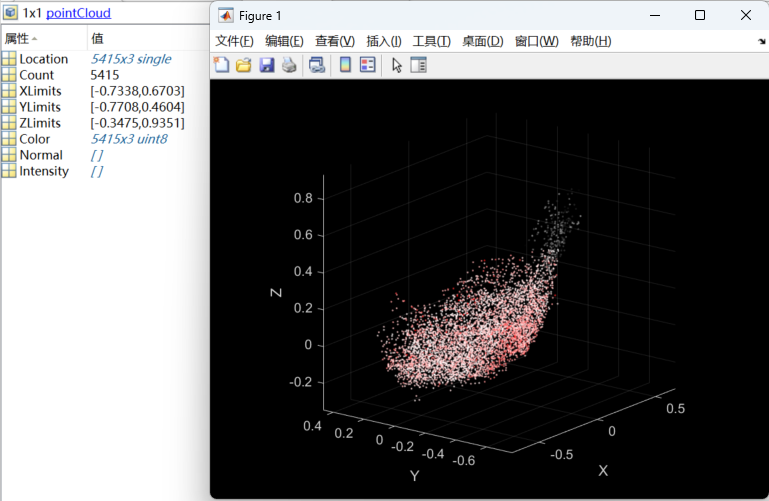
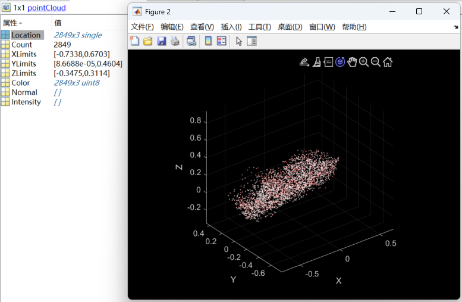
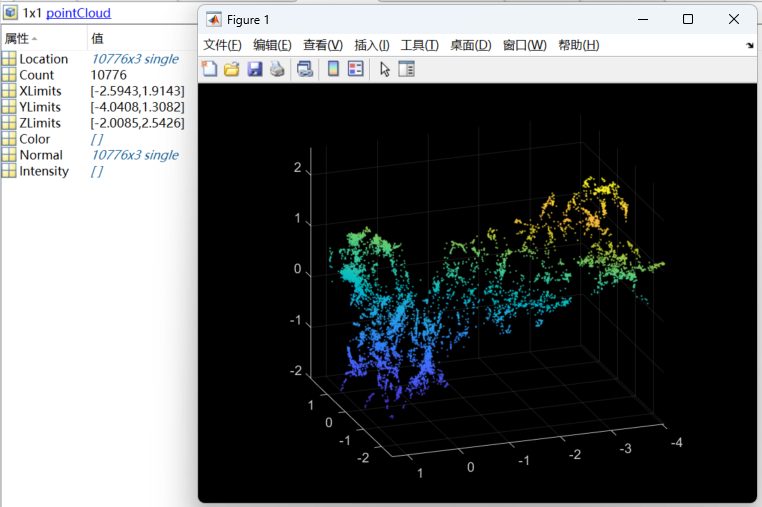
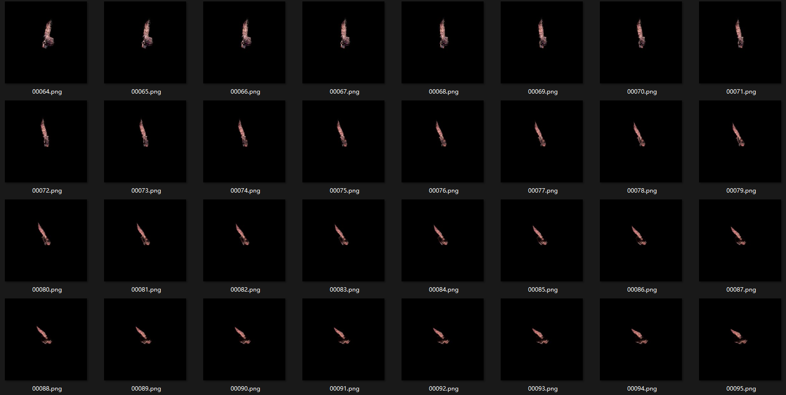
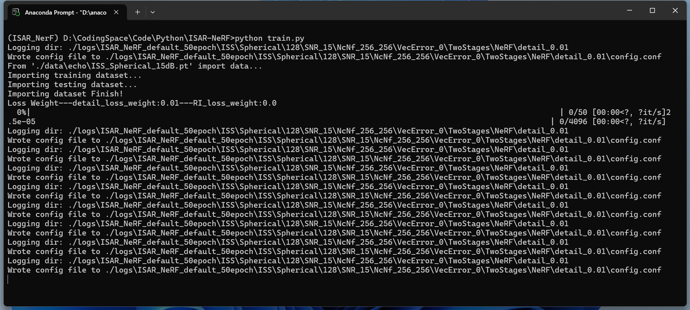

# 05.26

#### 1. 验证3DGS对局部缺损点云的恢复效果

| 下采样75%点云                                                | 局部缺损点云                                                 |
| ------------------------------------------------------------ | ------------------------------------------------------------ |
|  |  |
|  |  |

 **结论：**利用3DGS的自适应密度控制功能，在具有相同相机位姿的情况下，采用稀疏甚至局部缺损的初始点云，也能够拟合出目标的基本三维轮廓，不过训练时间会有所增加。

> 3DGS 是图像监督优化模型，点云只是初始化的起点。只要训练图像和相机位姿足够覆盖场景，3DGS 会自适应调整高斯分布，补齐缺失，达到几乎相同的渲染质量。

#### 2.ControlNet模型，修复低质量渲染ISAR图像

重建22张Aura目标的ISAR图像，由于ISAR图像比较模糊，单用3dgs在某些未知视角下渲染效果较差，利用基于ControlNet的扩散模型，可以有效改善未知视角下的渲染结果

- 数据对生成策略

  - 将22张图像分为22个子集，每个子集包含 22 张参考图像和 1 张**留空图像**
  - 对每个子集训练 3DGS 模型，并在训练过程中保存不同迭代阶段的留空视图渲染结果，与**留空图像**构成图像对（**X′**,**Xref**）。

- 扩散模型训练

  - 输入：低质量渲染图**X′** + 噪声参考图（添加 50% 高斯噪声的**Xref**）；
  - 输出：修复后的高质量修复图像**X^**

**结果：**

- 真实参考图像：

- 渲染任意视角下的图像：

#### 3.跑ISAR-NerF

