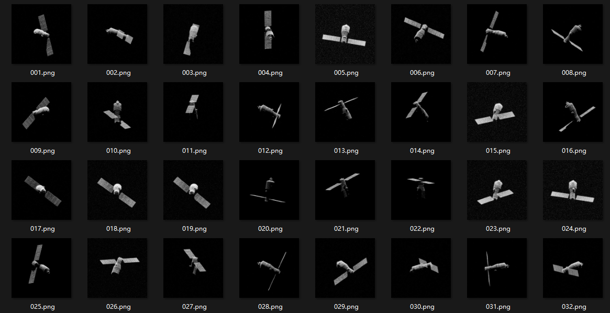
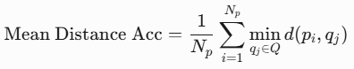
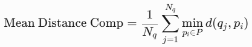

# 06.11

## 一.对比实验

### 1. 数据集信息

```text
- 目标物体：天宫一号 (TianGong1)

- 数据类型：球面数据 (Spherical)

- 信噪比：15dB

- 数据格式：.pt文件

- 旋转矩阵 (Rot)：256个3×3矩阵

- 距离采样 (Nrn)：1024

- 方位采样 (Nan)：1024

- 回波数据 (Echo_image)：256个1024×1024复矩阵

- 视线向量 (Los)：256个3维向量

- 采样频率 (fs)：4.5GHz

- 载波频率 (fc)：234GHz

- 训练图像数：128张

- 总图像数：128张
```



### 2.方法对比

|                          | PSNR              | SSIM               |
| ------------------------ | ----------------- | ------------------ |
| **ISAR-NeRF（128张图）** | 41.15473175048828 | 0.9648216623957392 |
| **3DGS（20张图）**       | 32.07288589477539 | 0.9150445461273193 |


## 二、三维指标

1.**预测点到真实点的平均距离**（Mean Distance Acc）



2.**真实点到预测点的平均距离**（Mean Distance Comp）



**ISAR-NeRF三维结果：**

阈值 = 1.0:

- 预测→真实的平均距离（准确度）：0.1751

- 真实→预测的平均距离（完整度）：0.1103

- 平均距离总体：0.1427

- 准确率：99.57%

- 完整率：100%

- F分数：0.9979（99.79%）

